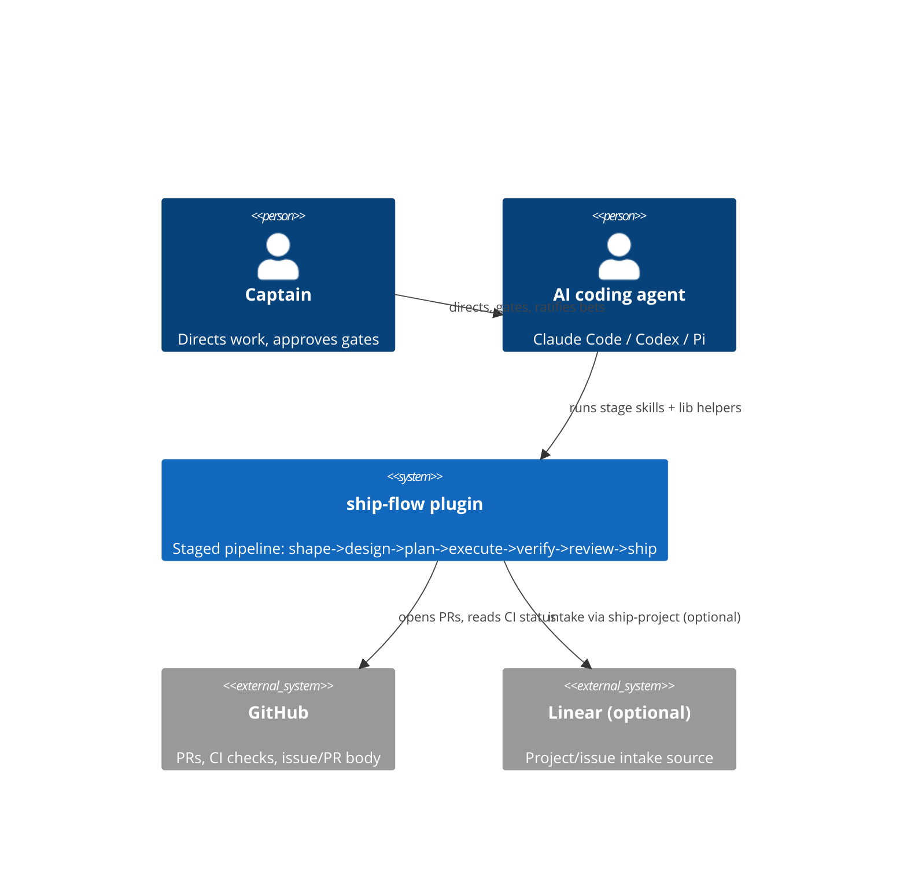
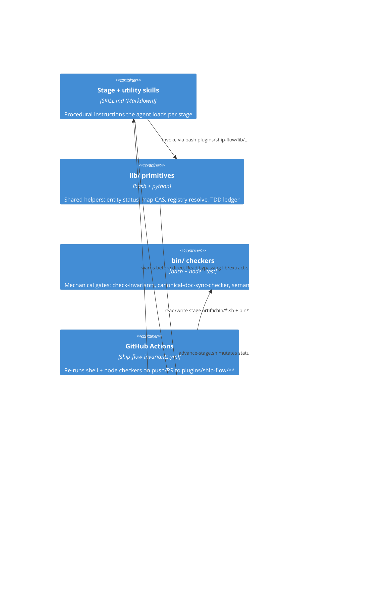
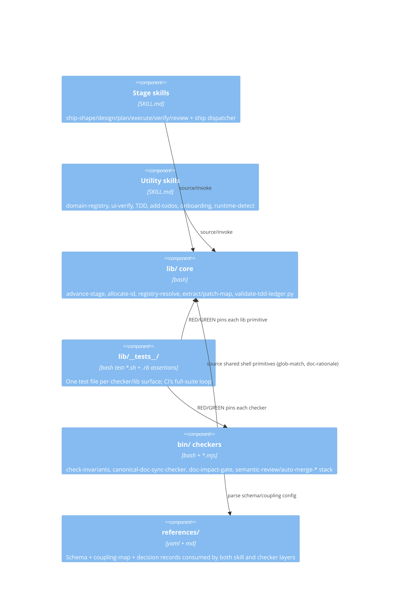

# ARCHITECTURE — spacedock-workflows / ship-flow

> Root canonical architecture doc (flow-map-schema, Principle 5b). Bootstrapped
> by entity `1-self-adoption-dogfood-bootstrap` (child 1.1); kept current by
> ship-review's canonical-doc sync at every subsequent entity that touches
> `plugins/ship-flow/` structure.

<!-- section:context -->
System context: a captain (human) directs an AI coding agent (Claude Code,
Codex, or Pi) through the ship-flow pipeline. The agent runs stage skills
shipped by the `ship-flow` plugin against this repo (or an adopter repo that
installed the plugin from this marketplace); pipeline state and PRs live on
GitHub, where CI enforces the plugin's own invariants.

<!-- /section:context -->

<!-- section:containers -->
Deployment units: the plugin is distributed as a Claude Code plugin
(`.claude-plugin/marketplace.json` -> `plugins/ship-flow/`). It has no
running service of its own — it is a tree of Markdown skill definitions and
shell/node CLI checkers invoked by the agent's shell, plus a GitHub Actions
workflow that re-runs those same checkers in CI.

<!-- /section:containers -->

<!-- section:components -->
Internal layering inside `plugins/ship-flow/`. `lib/` holds sourceable
primitives and stage-transition mechanics; `bin/` holds standalone CLI
checkers (each independently invocable, each with a sibling test); `skills/`
holds the 7 capped stage skills (`ship-shape` ... `ship-review`) plus
uncapped utility skills (`domain-registry`, `ui-verify`,
`test-driven-development`, `add-todos`, `ship-onboard`,
`ship-runtime-detect`, `verify-reviewer-panel`, `architecture-lens`,
`science-officer-em`, `harvest-decide`, `distill-reference`, `doc-sync`,
`memory-cleanup`, `codex-gate`, `ship-project`, `ship-epic`).
`references/*.yaml`/`.md` hold schemas consumed by both skills and checkers
(`flow-map-schema.yaml`, `entity-body-schema.yaml`, `doc-sync-context.md`,
`architecture-lens-triggers.yaml`, `stack-skill-map.yaml`,
`doc-coupling-map.yaml`).

<!-- /section:components -->

<!-- section:constraints -->
- No LLM semantic judgment in required CI (R3 boundary; carlove scar,
  2026-06-09) — mechanical gates only (presence, grammar, length, glob match).
  Semantic legitimacy checks live in advisory surfaces (PR review, ship-review
  canonical-doc route-back), never as a blocking CI step.
- Adopter policy (required reviewers, merge cadence, doc-coupling overrides)
  stays in adopter repos (`.claude/ship-flow/*.yaml` override precedent); the
  plugin owns generic mechanics only (Path A/B split, `references/pr-merge-paths.md`).
- Hermetic dependency policy (Principle 12): stage skills and `lib/*.sh` must
  not runtime-couple to `~/.claude/skills/gstack/` or generic `gstack-*`
  binaries; GStack-derived content (`lib/review-checklists/`,
  `lib/design-methodology/`) is a manual, captain-reviewed content snapshot.
- Stage skill count is capped at 7 (Principle 2); utility skills are
  uncapped but must justify inline-vs-separate via the small-function rule.
- Canonical docs (this file, PRODUCT.md, ROADMAP.md) are section-tag +
  script-mediated (Principle 5): mutate via `lib/patch-map.sh` CAS, not
  freehand edits, once a section exists.
<!-- /section:constraints -->

<!-- section:dependencies -->
- GitHub Actions (`ubuntu-latest`, `actions/checkout@v4`) — required CI host.
- bash 3.2+ (macOS default) / node 18+ (`node --test`) — no external shell
  or node package dependencies in the required path (Principle 12).
- `jq` — required by `scripts/check-version-triple.sh`.
- Optional: `codex` CLI on PATH for the adversarial Codex reviewer tier in
  ship-verify — gracefully degraded (never load-bearing) when absent.
- Optional at adoption time: `spacebridge` plugin (workflow scaffold bridge)
  and a Linear MCP connection (`ship-project` intake) — both degrade to
  manual-scaffold / manual-intake paths when absent.
- Blast radius: `bin/*.sh` and `lib/*.sh` are read by every CI run touching
  `plugins/ship-flow/**`; a broken checker fails the full suite for every PR
  in this repo and (once synced) every adopter repo pinned to that version.
<!-- /section:dependencies -->

<!-- section:decisions -->
| Entity | Decision |
| --- | --- |
| 1-self-adoption-dogfood-bootstrap | Bootstrapped this file (previously WARN-skipped by Principle 5b) + `PRODUCT.md`/`ROADMAP.md` completion; added `bin/doc-impact-gate.sh` — a mechanical, config-driven coupling gate (`references/doc-coupling-map.yaml`) that fails plugin-touching PRs which skip a coupled doc without a `doc-impact: none — <reason>` declaration. D1: new tight YAML coupling map (not a direct parse of the coarser `doc-sync-context.md`). D2: declaration lives in the PR body, passed to the checker as an explicit input — never fetched by the checker itself, preserving offline testability and the R3 mechanical-only boundary. D3: path-class threshold (coupling `srcGlobs` are the configurable surface; no LOC/file-count size variable). D4: shell checker family, sibling to `canonical-doc-sync-checker.sh`; `glob_to_regex` and `is_weak_skip_rationale` extracted from `resolve-skill-routing.sh` / `canonical-doc-sync-checker.sh` into sourceable `lib/glob-match.sh` / `lib/doc-rationale.sh` (DRY — second live consumer). |
| c14-fo-dispatch-contract | Defines exactly two independent owner-bearing transition contracts plus one narrow ownerless compatibility exception outside that contract model. First Officer stage entry uses a subject-only `dispatch:` or `advance:` receipt with a nonempty summary, every after-status bound to the named stage, and parent-revision direct/feedback graph validation first. Stage-worker completion uses the atomic `advance-stage.sh` helper chain only on compatible folder entities, registers the completed stage without entering the next one, and requires the caller to supply the completion signature before a real status mutation. Automation must never select the exception: First Officer automation still emits Contract 1. Only a graph-gated shape-confirm-era folder entity whose body table exists without `stage_outputs:` may use the ownerless legacy manual-mutation compatibility path until shape-confirm seeds that map; arbitrary manual bypass otherwise remains rejected. The checked-in skill/checker contract activates immediately for the next `/ship` and for a compatible current entity. Migration/rename is deferred to #36, merge semantics to #37, and authenticated provenance to #38. |
<!-- /section:decisions -->
