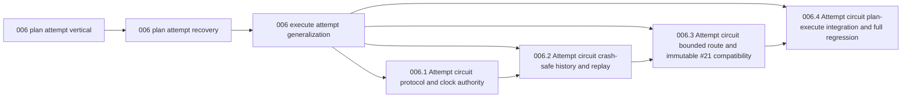

<!-- section:dependency-graph -->
## Dependency Graph

<!-- /section:dependency-graph -->

## Stage Report: shape

- DONE: Produce three schema-valid slug-native shaped children grounded in Epic 006's original end value and the captain's recorded failure lessons.
  Three folder children carry explicit slug IDs, 4h/4h/2h caps, concise shape hand-offs, and real plan -> recovery -> execute/#21 vertical outcomes.
- DONE: Make the old 006.1-006.4 lane reversibly non-ready without changing their status, verdict, PR, or implementation artifacts.
  Each original dependency list is preserved and gains only `006-execute-attempt-generalization`; the receipt records the exact rollback.
- DONE: Commit one explicit-path Phase A transaction only after focused schema, exact DAG ready-set, and slug dispatch-build probes pass.
  `status --validate` returned `VALID`, the ready set was exactly `006-plan-attempt-vertical`, and all three non-worktree `verify` builds emitted valid kebab-safe names; this enclosing commit is the explicit-path transaction.

### Summary

Phase A replaces the blocked helper-first continuation authority with three bounded, consumer-visible slices while preserving every old artifact. Phase B is gated on the first real plan vertical landing; no design, plan, implementation, PR, or dispatcher work starts here.
