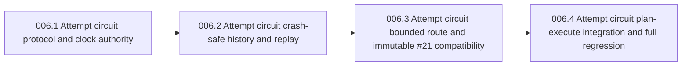

<!-- section:dependency-graph -->
## Dependency Graph

```mermaid
graph LR
  n006_1["006.1 Attempt circuit protocol and clock authority"]
  n006_2["006.2 Attempt circuit crash-safe history and replay"]
  n006_3["006.3 Attempt circuit bounded route and immutable #21 compatibility"]
  n006_4["006.4 Attempt circuit plan-execute integration and full regression"]
  n006_1 --> n006_2
  n006_2 --> n006_3
  n006_3 --> n006_4
```
<!-- /section:dependency-graph -->
