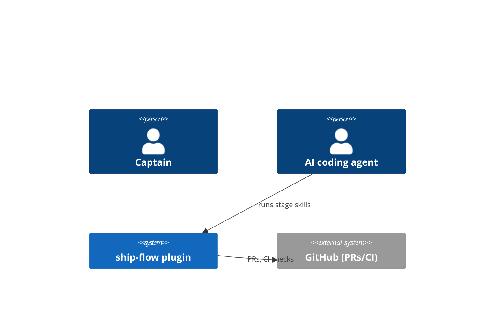
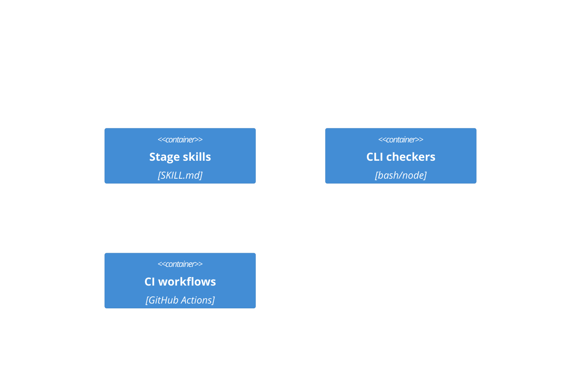
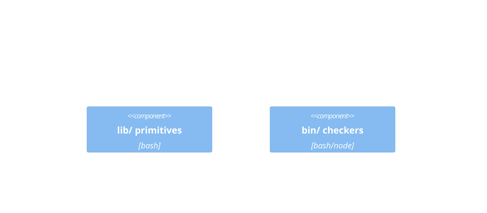

# Self-adoption dogfood bootstrap — canonical docs + doc-impact gate — Plan

## Plan Output

### Research Summary

Design.md already resolved D1-D4 via reverse-recovery (small-batch; no new
research dispatch). Plan-stage findings on top of design:

- `check_flow_map_coverage` (check-invariants.sh:197-240) only loops
  ARCHITECTURE.md's 6 tags; PRODUCT.md/ROADMAP.md already satisfy AC-1's
  weaker bar (exist + patchable markers, confirmed via direct read of
  skeleton commit `11350a0`) — no PRODUCT.md task; extending the checker is
  out of scope (design.md: child 1.1 "no checker delta").
- `is_weak_skip_rationale` strips on literal "skip", not "none" —
  empirically verified fix: wrap the extracted reason as synthetic
  `"skipped — <reason>"` before calling it unmodified (`"skipped —
  none"`→weak, `"skipped — <12+ chars>"`→ok). T2.2's reuse seam, not a
  re-implementation.
- `.claude/ship-flow/skill-routing.yaml` absent (no `.claude/` dir) — per FO
  dispatch note, **deferred**; `skills_needed` uses SKILL.md Step 3's generic
  file-signal table instead.
- `registry-resolve.sh --domain=schema` (from repo root) → status=ok, no
  required_skills/skill_hints — no forced skill. No architecture-lens
  trigger match (tag/customer/event-saga only) — no lens dispatch.

### Size Re-evaluation

No `size:` set at shape. Actual: 14 files, 3 children. Per Step 2.5
(4-10→M), **Adjusted size: M**.

### D4 Decision (design.md non-blocking sub-decision, recorded)

**Extract** (not copy-with-pointer): `glob_to_regex`
(resolve-skill-routing.sh:64-82) → `lib/glob-match.sh`;
`is_weak_skip_rationale` (canonical-doc-sync-checker.sh:114-133) →
`lib/doc-rationale.sh`. Both already behavior-tested; `doc-impact-gate.sh`
is the second live consumer — design.md's named DRY trigger. Task T2.1.

### Verification Spec

Entity uses `index.md` §Acceptance criteria (AC-1..AC-4) as Done Criteria —
this pitch's shape.md is prose-only (no `### Done Criteria` table).

| AC | Verify Procedure | Expected |
|---|---|---|
| AC-1 | `CI=true bash plugins/ship-flow/bin/check-invariants.sh 2>&1 \| grep -c 'WARN \[Principle 5b\]'` | `0` |
| AC-2 | `bash plugins/ship-flow/lib/__tests__/test-doc-impact-gate.sh` (RED pre-T2.2-GREEN); live CI run of this PR is the "one real PR" evidence, cited at review | exit 0, all PASS |
| AC-3 | (verify/review stage, out of plan scope) `bash "${CLAUDE_PLUGIN_ROOT:-plugins/ship-flow}/bin/canonical-doc-sync-checker.sh" docs/ship-flow/1-self-adoption-dogfood-bootstrap` | exit 0 |
| AC-4 | `test -f plugins/ship-flow/references/harvest-vocabulary.md && grep -q harvest-vocabulary.md plugins/ship-flow/README.md` | both true |

### Canonical Doc Actions

| Doc | Action | Source | Rationale |
|---|---|---|---|
| ARCHITECTURE.md | update | design | AC-1 + design.md Contract Deltas require six flow-map-schema sections (mermaid in first 3); currently WARN-skipped, zero content today. |
| PRODUCT.md | skip | spec | Skeleton already flow-map-schema compliant since commit 11350a0 (verified by direct read); ship-review's canonical sync appends the doc-impact-gate capability row at ship. |
| ROADMAP.md | update | spec | Move entity row from Next to Now to reflect active pipeline stage; ship-review adds a Shipped row at close. |

### Plan

Wave order: **W1** (T1.1 ∥ T1.2 ∥ T1.3, no deps) → **W2** (T2.1 → T2.2 →
{T2.3 ∥ T2.4}). All models: sonnet (shell/config/docs, no UI). Per-task
`owned_paths`/`parallel_group`/`depends_on`/`integration_owner`: Hand-off to
Execute → `plan_parallelization_manifest` table (all `integration_owner:
executer@pitch-1`) — not repeated per task below (DRY, single source).

#### T1.1 — Root ARCHITECTURE.md (child 1.1)
```yaml
task_id: T1.1
skills_needed: [write-docs]
desc: 6 flow-map-schema tags, mermaid in context/containers/components; content skeleton in <details> below.
done: "CI=true bash plugins/ship-flow/bin/check-invariants.sh 2>&1 | grep -c 'WARN \\[Principle 5b\\]'  # expect 0"
TDD: skip -- docs-only/stage-artifact; check_flow_map_coverage + test-c4-schema-linkage.sh cover it, not a new test.
layer: meta
```

#### T1.2 — ROADMAP.md Now-row hygiene (child 1.1)
```yaml
task_id: T1.2
skills_needed: [write-docs]
desc: Move "1-self-adoption-dogfood-bootstrap" row Next→Now (Stage=plan); Later/Not-doing/Shipped unchanged.
done: "grep -A3 '<!-- section:now -->' ROADMAP.md | grep -q 1-self-adoption-dogfood-bootstrap"
TDD: skip -- docs-only/stage-artifact; extract-map.sh non-empty check covers it, not a new test.
layer: meta
```

#### T1.3 — Harvest vocabulary decision record (child 1.3)
```yaml
task_id: T1.3
skills_needed: [write-docs]
desc: New references/harvest-vocabulary.md (pr-merge-paths.md pattern; skeleton in <details>) + one README further-reading bullet (~line 532).
done: "test -f plugins/ship-flow/references/harvest-vocabulary.md && grep -q harvest-vocabulary.md plugins/ship-flow/README.md"
TDD: skip -- docs-only/stage-artifact; check-no-dangling.sh covers the README link, not a new test.
layer: meta
```

#### T2.1 — Extract shared shell primitives (child 1.2, D4)
```yaml
task_id: T2.1
skills_needed: [test, best-practices]
desc: Move glob_to_regex/is_weak_skip_rationale into new libs; both consumers `source` them; delete inline copies; behavior unchanged.
regression_risk: test-adopter-skill-discovery.sh, test-canonical-doc-sync-checker.sh (behavior-only asserts, no line-number greps found) must stay green.
done: "bash plugins/ship-flow/lib/__tests__/test-adopter-skill-discovery.sh && bash plugins/ship-flow/lib/__tests__/test-canonical-doc-sync-checker.sh"
TDD: skip -- pure refactor with existing coverage (done: commands above are the regression gate).
layer: meta
```

#### T2.2 — doc-impact-gate.sh + coupling map (child 1.2, RED-first)
```yaml
task_id: T2.2
skills_needed: [test, best-practices]
desc: Author coupling-map (content in <details>) + test-doc-impact-gate.sh; run→RED (script absent); write doc-impact-gate.sh (logic in <details>); rerun→GREEN.
reviewer_questions: ["Coupling ≤3 rows, ≥12-char rationale each?", "Rejects --fix/--write/--apply/--sync/--repair (mirrors canonical-doc-sync-checker.sh:19-24)?"]
tdd_contract:
  red_command: "bash plugins/ship-flow/lib/__tests__/test-doc-impact-gate.sh"
  expected_red_failure: "FAIL: bin/doc-impact-gate.sh not found / gate-behavior assertions fail"
  green_command: "bash plugins/ship-flow/lib/__tests__/test-doc-impact-gate.sh"
  refactor_check: "bash plugins/ship-flow/lib/__tests__/test-doc-impact-gate.sh"
layer: L5
```

#### T2.3 — CI wiring (child 1.2)
```yaml
task_id: T2.3
skills_needed: [test, best-practices]
desc: Persist $CHANGED to a file in "Detect changed-file scope"; add doc-impact-gate step (plugin_changed gate, PR body via `env:`, never interpolated into `run:`); add 1 assertion. Diff in <details>.
regression_risk: test-ship-flow-ci-scope.sh's 6 existing assertions are presence-checks on unrelated regions — must stay green.
tdd_contract:
  red_command: "bash plugins/ship-flow/lib/__tests__/test-ship-flow-ci-scope.sh"
  expected_red_failure: "FAIL: new doc-impact-gate assertion — step/env pattern not yet in workflow"
  green_command: "bash plugins/ship-flow/lib/__tests__/test-ship-flow-ci-scope.sh"
  refactor_check: "bash plugins/ship-flow/lib/__tests__/test-ship-flow-ci-scope.sh"
layer: L5
```

#### T2.4 — doc-sync-context.md Source-Map row (child 1.2)
```yaml
task_id: T2.4
skills_needed: [write-docs]
desc: 'Add row to Shell Primitives sub-table: | `bin/doc-impact-gate.sh` | `README.md` (doc-impact-gate CI check) | `references/doc-coupling-map.yaml` |'
done: "bash scripts/check-no-dangling.sh"
TDD: skip -- docs-only reference-doc addition; no dedicated coverage test today per design.md, verified by check-no-dangling.sh.
layer: meta
```

<details>
<summary>Reference content — ARCHITECTURE.md skeleton (T1.1)</summary>

```markdown
# ARCHITECTURE — ship-flow

<!-- section:context -->

<!-- /section:context -->

<!-- section:containers -->

<!-- /section:containers -->

<!-- section:components -->

<!-- /section:components -->

<!-- section:constraints -->
- No LLM semantic judgment in required CI (R3 boundary; carlove scar).
- Adopter policy stays in adopter repos; plugin owns mechanics only.
<!-- /section:constraints -->

<!-- section:dependencies -->
- GitHub Actions (CI), Claude Code / Codex runtime, bash 3.2+/node 18+.
<!-- /section:dependencies -->

<!-- section:decisions -->
| Entity | Decision |
| --- | --- |
| 1-self-adoption-dogfood-bootstrap | D1-D4: doc-coupling-map.yaml tight YAML subset, PR-body declaration input seam, path-class threshold (no size var), shell checker family. |
<!-- /section:decisions -->
```

</details>

<details>
<summary>Reference content — doc-coupling-map.yaml (T2.2)</summary>

```yaml
# doc-coupling-map.yaml — see references/doc-sync-context.md §Source Map for
# the exhaustive release-time map; this is the tight per-PR mechanical subset.
# Resolution order: .claude/ship-flow/doc-coupling.yaml (adopter override,
# absent here) else this file.
schema_version: "1.0"
couplings:
  - name: stage-skill-readme
    srcGlobs: ["plugins/ship-flow/skills/ship-*/SKILL.md"]
    docPaths: ["plugins/ship-flow/README.md"]
    rationale: "Stage skill behavior changes drift from README pipeline/stage-flow prose (PR #6 precedent)."
  - name: reference-schema-readme
    srcGlobs: ["plugins/ship-flow/references/*.yaml"]
    docPaths: ["plugins/ship-flow/README.md"]
    rationale: "Schema/reference YAML changes must stay reflected in README schema summaries."
  - name: checker-source-map
    srcGlobs: ["plugins/ship-flow/bin/*.sh"]
    docPaths: ["plugins/ship-flow/references/doc-sync-context.md"]
    rationale: "New/changed shell checkers must register a Source-Map row per doc-sync-context.md's own coverage contract."
```

</details>

<details>
<summary>Reference logic — doc-impact-gate.sh (T2.2)</summary>

```
Usage: doc-impact-gate.sh --changed=<file-of-paths> --declaration=<text> [--coupling-map=<path>]
Reject --fix|--write|--apply|--sync|--repair (mirror canonical-doc-sync-checker.sh:19-24), exit 2.
Resolve map: --coupling-map override > .claude/ship-flow/doc-coupling.yaml > references/doc-coupling-map.yaml
source lib/glob-match.sh lib/doc-rationale.sh
Parse coupling rows line-based (mirrors resolve-skill-routing.sh's `- name:`/`srcGlobs:`/`docPaths:` reader).
extract_doc_impact_reason(): sed -E 's/.*[Dd][Oo][Cc]-[Ii][Mm][Pp][Aa][Cc][Tt]:[[:space:]]*[Nn][Oo][Nn][Ee][[:space:]]*[-—:|]*[[:space:]]*//' <<< "$declaration"
Weak check: is_weak_skip_rationale "skipped — ${reason}"  # reuse unmodified; synthetic "skipped —" prefix engages its keyword-strip.
For each coupling row:
  touched = any changed file matches srcGlobs (glob_to_regex) AND is not itself a docPath
  if !touched: continue
  if any changed file == a docPath: emit_pass; continue
  reason="$(extract_doc_impact_reason)"
  if [ -z "$reason" ] || is_weak_skip_rationale "skipped — ${reason}"; then
    emit_blocker "BLOCKER doc-impact: ${name} — changed ${srcGlob} but coupled doc ${docPath} not touched and no 'doc-impact: none — <reason>' declaration found"
  else emit_pass
exit 1 if any BLOCKER else 0
```

</details>

<details>
<summary>Reference diff — CI wiring (T2.3)</summary>

```yaml
# In "Detect changed-file scope" step, after CHANGED is computed, add:
printf '%s\n' "$CHANGED" > /tmp/ship_flow_changed_files.txt

# NEW step, after "Lightweight gate (docs-only / non-plugin changes)":
- name: doc-impact-gate (mechanical coupling gate)
  if: steps.ship_flow_scope.outputs.plugin_changed == 'true'
  env:
    PR_BODY: ${{ github.event.pull_request.body }}
  run: |
    bash plugins/ship-flow/bin/doc-impact-gate.sh \
      --changed=/tmp/ship_flow_changed_files.txt \
      --declaration="$PR_BODY"
```

```bash
# New assertion appended to test-ship-flow-ci-scope.sh:
check "doc-impact-gate step gated on plugin_changed, reads PR body via env indirection (no direct interpolation)" \
  "grep -q 'name: doc-impact-gate' '\${WORKFLOW}' && grep -qE \"if: steps\\.ship_flow_scope\\.outputs\\.plugin_changed == '\''true'\''\" '\${WORKFLOW}' && grep -q 'PR_BODY: \${{ github.event.pull_request.body }}' '\${WORKFLOW}'"
```

</details>

<details>
<summary>Reference content — harvest-vocabulary.md (T1.3)</summary>

```markdown
# Harvest Vocabulary — Decision Record

Pins three vocabularies used at different harvest-lifecycle points into one
system, so "promoted" / "Mechanical" / "D1" read as correspondences, not
competing taxonomies.

| debrief-guardrail-harvest bucket | harvest-decide outcome | kc-plugin-forge D-layer |
| --- | --- | --- |
| Mechanical | promoted / merged-into-canon | D1 (cross-project) |
| Semi-mechanical | promoted / merged-into-canon (project checker config) | D2 (project-specific) |
| Skill/mod | promoted / merged-into-canon | D1 |
| Workflow SOT | promoted | D1 |
| Todo/entity | kept-as-draft-memory (until entity ships) | D2 |
| No action | discarded | — |

References: `_mods/debrief-guardrail-harvest.md` §Classification;
`skills/harvest-decide/SKILL.md` §3; kc-plugin-forge `reference/skill-evolution.md`.
```

</details>

## Context Manifest

- **Skills loaded**: ship-plan, domain-registry, ship-runtime-detect (N/A — no framework, shell/CI only)
- **INVARIANTS sections read**: Principle 5 (5a/5b/5c, :96-119), Principle 6 Rule B/C (:119-274), Principle 8 verbosity (:288-408), Principle 12 Hermetic (:481-509)
- **Architecture docs consulted**: PRODUCT.md, ROADMAP.md (root, current skeleton), references/flow-map-schema.yaml, references/entity-body-schema.yaml → stages.plan
- **Domains touched**: schema (`registry-resolve.sh --domain=schema` → status=ok, required_skills empty)
- **Lens dispatched**: none (no trigger match — architecture-lens-triggers.yaml covers tag/customer/event-saga only)
- **Lens findings integrated**: 0 integrated, 0 deferred, 0 ignored (no lens fired)
- **Folder guidance**: none — `.claude/ship-flow/skill-routing.yaml` absent (deliberate defer, see Research Summary); `folder_guidance_files=`/`folder_guidance_skills=` both empty; `codex_context_boundary=root AGENTS.md/CLAUDE.md intentionally excluded` (N/A, none present)

## Plan Report

- status: passed
- stage_cost: solo ensign dispatch, no sub-agent research (small-batch; reverse-recovery resolved at design)
- iterations: 1 (self-review only; plan not gated per FO dispatch — advances straight to execute)
- dimensions: 12-dim self-review inline; zero placeholders, zero wave-cycle/overlap, TDD-first order honored (T2.2/T2.3 RED-before-GREEN), stale-line-anchors re-read this session (all current)
- reviewer_verdict: N/A (ungated stage per dispatch)
- scope_anchoring: AC-1←T1.1,T1.2 · AC-2←T2.1-T2.4 · AC-3←ship-review (outside plan scope) · AC-4←T1.3. No task outside index.md AC-1..AC-4 / design.md Contract Deltas.
- task_count: 7
- model_split: 7 sonnet (shell/config/docs; no UI)

### Metrics

- status: passed
- duration_minutes: 75
- iteration_count: 1
- task_count: 7
- verification_spec_count: 4
- model_split: 7 sonnet

### Hand-off to Execute

- wave_order: "W1 (T1.1 ∥ T1.2 ∥ T1.3) → W2 (T2.1 → T2.2 → {T2.3 ∥ T2.4})"
- tdd_ledger: `tdd-ledger.jsonl` (this folder) — `python3 plugins/ship-flow/lib/validate-tdd-ledger.py --plan docs/ship-flow/1-self-adoption-dogfood-bootstrap/plan.md --require-ledger-jsonl docs/ship-flow/1-self-adoption-dogfood-bootstrap/tdd-ledger.jsonl` → `status=pass records=7` (run at plan time, 2026-07-11).
- plan_parallelization_manifest:

| Task ID | Parallel Group | Depends On | Owned Paths | Integration Owner |
|---|---|---|---|---|
| T1.1 | wave1 | — | ARCHITECTURE.md | executer@pitch-1 |
| T1.2 | wave1 | — | ROADMAP.md | executer@pitch-1 |
| T1.3 | wave1 | — | references/harvest-vocabulary.md, README.md | executer@pitch-1 |
| T2.1 | wave2-a | T1.1, T1.2 | lib/glob-match.sh, lib/doc-rationale.sh, lib/resolve-skill-routing.sh, bin/canonical-doc-sync-checker.sh | executer@pitch-1 |
| T2.2 | wave2-b | T2.1 | references/doc-coupling-map.yaml, bin/doc-impact-gate.sh, lib/__tests__/test-doc-impact-gate.sh | executer@pitch-1 |
| T2.3 | wave2-c | T2.2 | .github/workflows/ship-flow-invariants.yml, lib/__tests__/test-ship-flow-ci-scope.sh | executer@pitch-1 |
| T2.4 | wave2-c | T2.2 | references/doc-sync-context.md | executer@pitch-1 |

- domain_acceptance_checklist: N/A (no domain lens triggered; reviewer_questions embedded per-task above). canonical_doc_actions_summary: mirrors §Canonical Doc Actions above. critical_assumptions: ARCHITECTURE.md confirmed absent at repo root 2026-07-11 — re-verify at execute boot in case a parallel session created it first.
- architecture_context: ARCHITECTURE.md creation (6 sections) + ROADMAP.md Now-row move; PRODUCT.md untouched (see Canonical Doc Actions skip rationale).
- stub_flags: none (no v1-stub/placeholder tasks). folder_guidance: none (`.claude/ship-flow/` absent; skill-routing.yaml deferred, see Research Summary).
