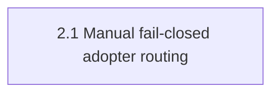

# Deterministic manual adopter skill routing — Shape

## Problem

Repository-wide skill discovery can report success while suppressing nested producer failures, so captains cannot trust the routing used by onboard, shape, design, plan, execute, verify, or receipts.

## Acceptance Outcome

When a new or manually onboarded adopter routes explicitly supplied task files, the captain receives exact skills and guidance from one committed manifest; missing or invalid routing stops before dispatch, and no production path scans the repository.

## Captain Bet (gate approval 2026-07-13)

修完後第一次真實執行且零錯誤 routing

## Appetite

small-batch (2-3 days)

## Shape Mode

```yaml
shape_mode: mode-b
```

## Children

| Entity | Vertical slice | Depends on |
| --- | --- | --- |
| `2.1-manual-fail-closed-adopter-routing` | Route every stage from one strict manual manifest, preserve legacy reads, and remove scanner reachability and stale visible documentation. | `[]` |

## Dependency Graph



## Assumptions

```yaml
stated_assumptions:
  - id: A1
    claim: "The existing explicit manifest, resolver, downstream consumers, and receipt seams can support a strict fail-closed cutover within the appetite."
    verified_by: codebase-grep
    verification: "Static inspection of the manifest resolver and its focused tests; repository discovery and density classification are prohibited."
    confidence_at_shape: 90
    criticality: critical
  - id: A2
    claim: "Legacy source: discovered manifests can remain readable while all newly created manifests use source: manual."
    verified_by: design-contract
    verification: "Captain selected this compatibility contract during the Mode B question loop."
    confidence_at_shape: 85
    criticality: important
```

## Pre-mortem

```yaml
category: hidden-dependency
one_liner: "An overlooked stage bypasses strict resolution or receipt sequencing, letting an invalid manifest reach dispatch despite isolated tests."
```

## Rabbit Holes

```yaml
rabbit_holes: []
```

The empty list is explicit: the confirmed proposal considered no rabbit holes for this pitch.

## Deleted From Shape

| Rejected | Reason |
| --- | --- |
| Patch or retain the repository-scanning discovery helper | The captain rejected the helper strategy after repeated suppressible producer failures. |
| Redesign density classification or upstream spacedock status --discover (#24) | Separate existing issues outside this 2-3 day appetite. |
| Automatically migrate existing adopters or introduce multiple routing manifests | The selected contract keeps legacy configs readable and adds one canonical manual source. |

## Canonical Doc Impacts

### Mandatory Updates

- `plugins/ship-flow/README.md`
- `docs/ship-flow/README.md`
- `ARCHITECTURE.md`
- `PRODUCT.md`
- onboard/shape/design/plan/execute/verify stage skills
- routing schema, starter template, legacy guidance, and doc-impact gates

### Ship-review Owner

Ship-review must apply every confirmed update or record an explicit evidence-backed skip; implementation cannot ship with stale visible behavior docs.

### Hand-off to Design

```yaml
design_required: true
contract_decision_required: false
open_design_questions: []
open_contract_decisions: []
canonical_context:
  - PRODUCT.md#capabilities
  - ARCHITECTURE.md#components
  - ARCHITECTURE.md#constraints
```

The non-UI design stage must define the routing contract and generic apply boundary. No unresolved contract choice is delegated to plan; `contract_decision_required: false` is an explicit confirmed signal, not a missing field.
