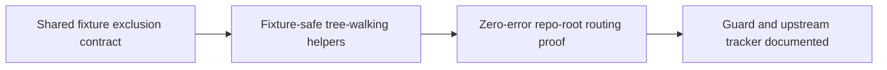

# Fixture-tree exclusion for discovery helpers — Shape

<!-- section:pm-skill-receipts -->
```yaml
pm_skill_receipts:
  stage: ship-shape
  mode: mode-a
  appetite: small-batch
  compose_guard: passed
  receipts:
    - phase: intake-problem
      delegate: problem-framing-canvas
      required: true
      status: unavailable
      evidence:
      fallback: inline
      rationale: Captain-confirmed problem and the verbatim flat draft supplied the framing.
    - phase: scope-decompose
      delegate: opportunity-solution-tree
      required: true
      status: unavailable
      evidence:
      fallback: inline
      rationale: Reviewer-approved W1-W3 and explicit exclusions supplied the scope cut.
    - phase: assumption-extract
      delegate: pol-probe-advisor
      required: true
      status: unavailable
      evidence:
      fallback: inline
      rationale: The shared exclusion contract was identified as the critical assumption inline.
    - phase: acceptance-outcome
      delegate: press-release
      required: true
      status: unavailable
      evidence:
      fallback: inline
      rationale: The captain-authored first-real-run Bet supplied the observable outcome.
```
<!-- /section:pm-skill-receipts -->

## Problem

`spacedock status --discover` and `plugins/ship-flow/lib/discover-adopter-skills.sh` both match plugin test fixtures when run inside the plugin repo. FO boot discovery lists 4 bogus workflow candidates from `plugins/ship-flow/lib/__tests__/fixtures/workflow-doctor/*` (reproduced at FO boot 2026-07-12 — forces `--workflow-dir` on every helper call); adopter-skill discovery drafts were unusable in pitch 1 shape (carlove-shaped routing from fixture content). WHO pays: every FO session in this repo, and shape-stage skill routing in any adopter repo that vendors fixtures.

Scope note: `status --discover` lives in the spacedock binary (upstream repo — debrief 2026-07-12-01 lists it as candidate upstream issue, not filed); the ship-flow-owned surface here is `discover-adopter-skills.sh` and any other lib/bin helper that walks the tree without fixture exclusion.

## Acceptance Outcome

On the first real repository-root run after this ships, ship-flow-owned discovery
helpers complete with zero fixture-derived routing and no helper error. If that
still fails, the result is evidence that the helper-based strategy itself needs
to be reconsidered rather than patched again.

## Appetite

`small-batch` — 1-2 days. The budget includes the shared exclusion contract,
all ship-flow-owned tree-walking consumers, focused regressions, and the
documented upstream guard/tracker.

### Will get

- **W1**: When ship-flow discovery runs at repository root, the captain can
  obtain routing with zero signals derived from test-fixture trees. (Check:
  W1 in `Will-get dogfood checks`.)
- **W2**: When any ship-flow-owned helper walks the repository tree, maintainers
  can rely on one shared fixture-exclusion surface, including
  `density-classify.sh`, without duplicated fixture-path rules. (Check: W2 in
  `Will-get dogfood checks`.)
- **W3**: When the upstream `spacedock` discovery symptom remains, operators can
  follow a documented `--workflow-dir` guard and trace the approved upstream
  filing through local tracker `#24`. (Check: W3 in `Will-get dogfood checks`.)

### Won't get

- No implementation change to the `spacedock-dev/spacedock` binary.
- No `.gitignore`-derived exclusion source.
- No sweep or refactor of helpers that do not walk a repository tree.

### Why this scope

A shared ship-flow exclusion contract removes the local class of fixture
pollution within the appetite; widening into the upstream binary or unrelated
helpers would combine separate ownership and verification boundaries.

## Captain Bet (gate approval 2026-07-13)

> ship-flow helpers 不再有不正確的運作問題，如果處理完仍有問題則表示用 helper 這條路可能策略不對
>
> 修完後第一次真實執行且零錯誤 routing

## Acceptance criteria

**AC-1 — discover-adopter-skills.sh ignores fixture trees.**
Verified by: running it from this repo root yields zero candidates sourced from `lib/__tests__/fixtures/**`; regression test with a fixture-shaped decoy tree.

**AC-2 — the exclusion rule is shared, not one-off.**
Verified by: a single exclusion helper/config consumed by every tree-walking lib/bin helper (grep shows no duplicated hardcoded fixture paths).

**AC-3 — upstream `status --discover` gap is filed or worked around.**
Verified by: GitHub issue link on the spacedock repo, or a documented `--workflow-dir` guard in this instance README.

## Will-get dogfood checks

- **W1**: Run `discover-adopter-skills.sh --root=.` from this repository and
  assert that no emitted route is sourced from
  `plugins/ship-flow/lib/__tests__/fixtures/**`, including a fixture-shaped
  decoy that would otherwise produce a route.
- **W2**: Inventory every ship-flow-owned lib/bin helper that walks the
  repository tree, explicitly including `density-classify.sh`; verify each
  consumes the same exclusion surface and grep for zero duplicated hardcoded
  fixture paths outside that surface.
- **W3**: Verify the instance README documents the explicit `--workflow-dir`
  guard and links local tracker
  [`#24`](https://github.com/iamcxa/spacedock-workflows/issues/24); the eventual
  `spacedock-dev/spacedock` filing is approved, while a binary fix is excluded.

## Scope

### In

- Fixture-derived route elimination for `discover-adopter-skills.sh` when run
  at repository root.
- One exclusion contract shared by every ship-flow-owned tree-walking helper,
  explicitly including `density-classify.sh`.
- Regression coverage for the shared behavior and the first real zero-error
  routing run.
- Instance documentation for the upstream guard and local tracker `#24`; the
  eventual upstream filing is approved.

### Out

- Upstream `spacedock` binary implementation.
- `.gitignore` as the policy source.
- Non-tree-walking helper cleanup.

## Stated Assumptions

- **A1 (critical, 75%)**: One shared exclusion contract can serve every
  ship-flow-owned tree walker without changing intended non-fixture discovery.
  `verified_by: codebase-grep`; design must settle the cross-runtime consumer
  contract and the exact path-segment semantics.
- **A2 (important, 95%)**: `spacedock status --discover` is a separate upstream
  symptom, not proof that the ship-flow helper fix failed. `verified_by:
  codebase-grep` plus tracker `#24`.
- **A3 (important, 90%)**: The workflow instance remains operable with an
  explicit `--workflow-dir docs/ship-flow` guard until upstream discovery is
  corrected. `verified_by: codebase-grep` plus tracker `#24`.

## L0 Research Boundary

- Definite consumers: `lib/discover-adopter-skills.sh` and
  `lib/density-classify.sh`; both recursively inspect repository content and
  can let nested fixture decoys affect routing or density.
- Existing pattern: `discover-adopter-skills.sh` already centralizes its local
  pruning in `find_pruned`; `lib/glob-match.sh` is the repo precedent for a
  shared sourceable shell primitive.
- Test constraint: existing tests intentionally invoke discovery with a root
  whose own absolute path is under `fixtures`, so the contract must prune
  nested fixture trees relative to that root rather than reject the root.
- Audited outside the pollution boundary: bounded workflow/entity scanners and
  validators that cannot reach plugin fixtures during normal operation or
  intentionally accept fixture roots.

## Rejected Alternatives

- Use `.gitignore` as the exclusion source — explicitly excluded and would
  couple helper correctness to adopter ignore policy.
- Add a hardcoded fixture path independently to each helper — violates W2 and
  creates immediate drift.
- Fix the upstream binary in the same pitch — separate repository, ownership,
  and verification boundary; tracker `#24` retains the symptom.
- Sweep non-tree-walking helpers — no evidence they participate in fixture
  pollution and they do not contribute to the acceptance outcome.

## Pre-mortem

`hidden-dependency`: the ship-flow helpers become fixture-safe, but upstream
`status --discover` still reports fixture workflows and is mistaken for a local
regression.

## DAG



## Canonical Intent

- `PRODUCT.md`: skip — this is correctness of an existing internal capability,
  not a new durable product capability or user story.
- `ARCHITECTURE.md`: skip — the lib/bin layering and component boundaries do
  not change; design resolves an internal shared-helper contract.
- Root `README.md`: skip — no install, command, or quick-start contract changes.
- `docs/ship-flow/README.md`: update in implementation scope for the explicit
  `--workflow-dir` guard and tracker `#24` required by W3.

## Upstream Guard and Tracker

- Local tracker: [`iamcxa/spacedock-workflows#24`](https://github.com/iamcxa/spacedock-workflows/issues/24), open at shape confirmation.
- Upstream target: `spacedock-dev/spacedock`; filing is captain-approved.
- Shape boundary: record the decision only. Do not file or implement the
  upstream binary change during shape.

## Shape-confirm Tool Evidence

The native atomic path was attempted from the assigned linked worktree:

```text
bash plugins/ship-flow/lib/shape-confirm.sh \
  --proposal=.shape-confirm-proposal.json \
  --layout=folder \
  --workflow-dir=docs/ship-flow
exit=10
Error: proposal missing pitch.id / pitch.slug / pitch.title
```

This instance declares `id-style: slug`; issue `#21` records that
`shape-confirm.sh` requires a numeric pitch ID, writes legacy `sharp` state,
and cannot absorb a pre-existing flat entity. The narrow migration mitigation
therefore absorbed only the existing flat entity into this slug-named folder,
preserved its body, promoted its todo, and moved its ROADMAP row. No
implementation source or tests changed.

## Domain Registry Validation

- classify: `bash plugins/ship-flow/lib/registry-resolve.sh --classify docs/ship-flow/fixture-pollution-discovery-helpers/shape.md`
- validate: `bash plugins/ship-flow/lib/registry-resolve.sh --validate --domain=schema`
- domain: schema
- result: proceed

## Project Skills

- `.claude/ship-flow/domains.yaml`: absent.
- `.claude/ship-flow/skill-routing.yaml`: absent.
- The current discovery draft is the polluted surface this pitch exists to
  repair, so shape does not accept or persist its fixture-derived output.

### Hand-off to Design

- `affects_ui: false`; `ui_surfaces` and `framework_detected` omitted.
- `open_design_questions`: []
- `open_contract_decisions[]`:
  1. Shared-surface form for the current Bash consumers: sourceable helper or
     declarative config, including how future non-shell walkers consume the
     same source without duplicating path rules.
  2. Exclusion semantics: which fixture/test path segments define nested trees
     relative to the requested root without rejecting a legitimate fixture-root
     test or adopter content; `.gitignore` is not allowed.
  3. Inventory proof: the mechanical boundary for “ship-flow-owned
     tree-walking helper,” keeping bounded validators out while proving both
     definite consumers, including `density-classify.sh`, adopt the contract.
- `pm_framing_output`: this file's `pm-skill-receipts` section.
- route: `design` (`domain: schema`, `contract_decision_required: true`).

## Shape Report

- Appetite-fit: one 1-2 day small batch with headroom; upstream binary work and
  unrelated helper cleanup were cut rather than stretching the budget.
- Cross-review: dispatch supplied reviewer-approved W1-W3, explicit won't-get
  boundaries, and the `hidden-dependency` pre-mortem category.
- Canonical preflight: ROADMAP, PRODUCT, ARCHITECTURE, workflow README, and the
  latest debrief were read before confirmation.
- Atomic-path result: blocked by known issue `#21`; narrow migration mitigation
  used with failure evidence above.
