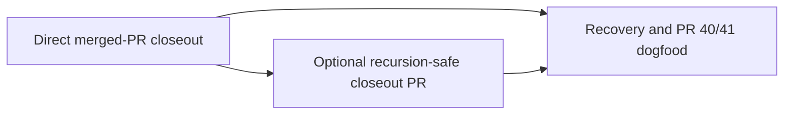

# Make debrief a native post-merge ship closeout — Shape

<!-- section:pm-skill-receipts -->
```yaml
pm_skill_receipts:
  stage: ship-shape
  mode: mode-a
  appetite: medium-batch
  compose_guard: passed
  receipts:
    - phase: intake-problem
      delegate: problem-framing-canvas
      required: true
      status: unavailable
      evidence: ""
      fallback: "Inline: the captain directive and PR #40/#41 manual closeout identify the lifecycle gap, operator, and concrete cost."
      rationale: "The delegate is not installed in this runtime."
    - phase: scope-decompose
      delegate: opportunity-solution-tree
      required: true
      status: unavailable
      evidence: ""
      fallback: "Inline: three end-to-end slices cover direct closeout, optional closeout PR, and recovery/dogfood."
      rationale: "The delegate is not installed in this runtime."
    - phase: assumption-extract
      delegate: pol-probe-advisor
      required: true
      status: unavailable
      evidence: ""
      fallback: "Inline POL probe: the collapse point is trustworthy landing identity across merge strategies; verified with live PRs and a disposable topology probe."
      rationale: "The delegate is not installed; the mandatory medium-batch POL probe ran inline."
    - phase: acceptance-outcome
      delegate: press-release
      required: true
      status: unavailable
      evidence: ""
      fallback: "Inline: the outcome is one observable FO cycle from MERGED to debriefed, archived, and Shipped with the real landing facts."
      rationale: "The delegate is not installed in this runtime."
```
<!-- /section:pm-skill-receipts -->

## Captain Articulation Trail

**Q1 (Problem): What gets worse without this?**
> After an implementation PR is merged, one bounded FO post-merge cycle must use GitHub's real `mergedAt` and landing facts to produce the final debrief and compact ship receipt, advance `ship -> done` with `PASSED`, archive the entity, move the ROADMAP row to Shipped, and optionally create one closeout PR.

**Q2 (Appetite): How long?**
> Default to `medium-batch`, `design_required: true`, and `contract_decision_required: true` unless evidence disproves them.

**Q3 (Wedge): Which risk comes first?**
> Run the riskiest landing-SHA/range probe before composing the proposal.

**Q4 (Out of scope): What is happily excluded?**
> Do not redo completed #20/#22/#28. Do not include #21 shape-confirm-instance-awareness. Do not touch C14 or RoboRev orphan worktrees. Do not post or modify upstream issues #24-#27. Do not hardcode Slack, Linear, or any specific task manager into core.

**Q5 (Assumption): What could be wrong?**
> Pre-merge may prepare only a skeleton or intent; final debrief evidence must use post-merge `mergedAt` and the true landing SHA, never a rebase-rewritten PR-head SHA.

The proposal below organizes these captain-authored constraints and preserves
the Captain Bet verbatim; it does not substitute a new problem frame.

## Problem

Ship-flow currently treats PR creation as the last native ship action and uses
a separate reconciler to mark a merged entity done and archive it. That
reconciler reads `mergedAt` but discards it, does not read a landing commit,
does not produce the final debrief or compact ship receipt, and does not move
the ROADMAP row. PR #40/#41 therefore required a second manual ritual whose
landing boundary could easily be confused with a rewritten PR head or a later
`main` tip.

## Acceptance Outcome

When an implementation PR becomes `MERGED`, one bounded FO startup or idle
cycle leaves the captain with a final debrief and compact ship receipt that
name the real merge time and landing commits, a coherent done/PASSED archive,
and exactly one Shipped ROADMAP row. An optional closeout PR is created at most
once and its own merge cannot recurse.

## Appetite

`medium-batch` — 1-2 weeks, capped at 10 working days. Three delivery slices
consume at most 7 days, preserving at least 30% headroom for integration and
cross-review findings.

### Will get

- **W1**: When a GitHub implementation PR reaches `MERGED`, the FO can finish
  debrief, receipt, terminal state, archive, and ROADMAP closeout in one
  startup/idle cycle. (Check: W1 in `Will-get dogfood checks`.)
- **W2**: When GitHub lands by rebase, squash, or merge commit while `main`
  moves, the captain can audit `mergedAt` and the exact landing commit set
  without trusting the PR-head SHA or current branch tip. (Check: W2.)
- **W3**: When closeout restarts after any durable write, the FO can resume
  without duplicating a debrief, archive, ROADMAP row, or optional closeout PR.
  (Check: W3.)

### Won't get

- No eighth stage skill or separate debrief ceremony outside the ship
  lifecycle.
- No GitLab/provider-general closeout, Slack/Linear/task-manager coupling, or
  upstream issue work.
- No C14, C15-cap, todo-accounting, or PR-body-binding semantic change.
- No repair of #21, #20/#22/#28, or RoboRev orphan worktrees.

### Why this scope

Extending the existing GitHub reconciler and ship contract is the narrowest
path to the captain's outcome; a new stage or provider framework would enlarge
the lifecycle without closing the proven PR #40/#41 gap.

## Captain Bet

When this ships, the captain expects a merged implementation PR to reach a debriefed, archived done state with its real landing SHA within one FO post-merge closeout cycle. If not, this pitch was wrong about the Layer 1 claim that debrief belongs to the ship lifecycle rather than an ad-hoc session ritual.

## Acceptance Criteria

### AC-1 — trustworthy landing envelope

Runtime fixtures for rebase, squash, and merge-commit strategies, each with
concurrent `main` movement, emit the provider `mergedAt`, landing anchor,
`base_before`, ordered `landing_commits`, and first/last landing commits.
Rebase-rewritten PR-head SHA and post-landing `main` tip are never accepted as
landing facts. The receipt preserves full 40-character SHAs; display-only
debrief fields may abbreviate them. Ambiguous topology, method, ownership, or
patch equivalence fails closed with a stable reason.

### AC-2 — one-cycle observable closeout

One startup/idle invocation after an implementation PR becomes `MERGED`
produces the final debrief, final compact `ship.md`, `status: done`,
`verdict: PASSED`, coherent archive, and one ROADMAP Shipped row. The receipt
records the PR number, provider merge time, landing envelope, and closeout
classification. If the optional PR path cannot make this state authoritative
on `main` within that cycle, it records an explicit awaiting-merge checkpoint
rather than claiming terminal success.

### AC-3 — debrief fidelity

The generated debrief passes `debrief-schema.yaml`, preserves full
reconciliation and todo digest content, and retains the existing balanced
standalone `<details>` exclusion rule for body counts. Its first/last commit
fields derive from the landing envelope rather than session HEAD guesses.

### AC-4 — resumable transaction and idempotency

Every durable side effect has a monotonic checkpoint or a proof-based
already-applied test. Repeating closeout at least twice after success and from
each partial-state fixture creates no duplicate debrief, archive, ROADMAP row,
or PR. Terminal success is withheld until the archive and canonical row agree.

### AC-5 — mechanical recursion guard

An optional closeout PR carries a persisted sentinel that is validated from
machine-readable state, not title or prose. Its merge is classified as
closeout-only and produces no further closeout PR or debrief cycle.

### AC-6 — fail-closed recovery matrix

Missing PR mirrors, missing `review.md`, missing/finalized `ship.md`, partial
archive, pre-existing debrief, already-moved ROADMAP row, dirty worktree, and
incoherent archived entity fixtures either resume to the same terminal state
or stop with stable reason codes and no destructive cleanup. Shared-PR entities
and indirect landing are never silently assigned closeout ownership.

### AC-7 — compatibility envelope

Existing ship-final PR-body binding, `persist-pr-metadata.sh`, C14, C15
(`ship.md` remains at its current cap), todo accounting, canonical-doc CAS,
provider-scope, and worktree/branch safety tests remain green. No implementation
path hardcodes a task manager.

### AC-8 — PR #40/#41 dogfood value proof

A frozen regression fixture representing PR #40's rewritten landing and PR
#41's manual closeout reaches the final reconciled state in one invocation
without hand-editing `index.md`, `ship.md`, a debrief, or `ROADMAP.md`; a second
invocation is a no-op.

## Will-get dogfood checks

- **W1**: Start from a `ship` entity whose implementation PR fixture changes
  from OPEN to MERGED; invoke the startup/idle closeout once and assert the
  schema-valid debrief, compact receipt, archive, and Shipped row all agree.
- **W2**: For all three strategies, advance `main` before and after landing;
  assert the stored anchor/set remain provider- and topology-derived and differ
  from invalid original heads or later tips where rewriting/movement occurs.
- **W3**: Inject a stop after each durable write, resume twice, and assert one
  identity-keyed debrief, archive, row, and optional closeout PR with the same
  receipt hash.

## Delivery Slices and Appetite Fit

| Slice | End-to-end outcome | Budget | Depends on |
| --- | --- | ---: | --- |
| Direct merged-PR closeout | A merged implementation PR closes locally in one cycle with trustworthy landing facts and no follow-up PR. | 3d | none |
| Optional recursion-safe closeout PR | The same closeout can publish one sentinel-classified PR whose merge is a terminal no-op. | 2d | direct closeout |
| Recovery and #40/#41 dogfood | Every partial state resumes or fails closed, then the frozen real-world fixture proves the value outcome. | 2d | both prior slices |

The 7-day sum is below 80% of the 10-day cap. Provider expansion, stage
creation, and unrelated lifecycle cleanup were cut rather than stretching the
appetite.

## Dependency Graph



## Landing-Evidence Probe

The bounded probe used a disposable Git repository with a two-commit topic,
one concurrent `main` commit before landing, and another after landing. It
recorded provider-shaped `mergedAt` plus `mergeCommit.oid`; the workspace was
not modified.

| Strategy | Trustworthy derivation | Observed invalid shortcut |
| --- | --- | --- |
| Rebase | Anchor is last rewritten commit; walk the verified PR commit count to first, persist `base_before` and ordered rewritten set. | Original PR head differed from last; later main tip differed from anchor. |
| Squash | Anchor is the sole landing commit, so first=last=anchor; aggregate diff must match the PR change. | Original PR head and later main tip both differed from anchor. |
| Merge commit | Anchor has two parents; ordered landing set is topic-only commits plus anchor, with first topic commit and last=anchor. | First/last alone cannot prove the exact set; current main tip is unrelated. |

Live repository evidence agrees: PR #13 is a two-parent merge commit; PR #14
is a one-commit squash; PR #40 has 29 rewritten commits ending at
`d6d3ce4`, whose anchor-derived first is `41227d4` while its original PR head
was `987ddba`. PR #41 rewrote eight commits to `024036b..6c5a94b`; its
original head `49af1c2` is not a landing boundary.

GitHub's official API contract defines `mergedAt` as the merge time and the
post-merge `merge_commit_sha` as the merge commit, squash commit, or updated
base commit depending on strategy. GitHub also states that rebase-and-merge
rewrites commit SHAs. Design must pin the exact classification/patch-equivalence
grammar and stable reason vocabulary; plan must not choose it silently.

## Stated Assumptions

- **A1 (critical, 95%)**: Provider `mergedAt` plus the post-merge landing
  anchor, topology, PR commit count, and patch equivalence can identify the
  real ordered landing set across all three strategies despite concurrent
  `main` movement. `verified_by: codebase-grep`; verified by the disposable
  probe and live PR #13/#14/#40/#41 topology.
- **A2 (critical, 75%)**: The existing reconciler can become a resumable
  closeout transaction without weakening status/archive/worktree fail-closed
  behavior. `verified_by: design-contract`; current code exposes sequenced
  mutation seams but has no checkpoint, so design must ratify the journal and
  commit boundary.
- **A3 (important, 85%)**: A persisted sentinel tied to implementation PR and
  entity identity can classify an optional closeout PR without title guessing.
  `verified_by: design-contract`; exact sentinel location and validation remain
  open for design.
- **A4 (important, 90%)**: Existing debrief schema, todo digest, C15 counter,
  canonical map CAS, and `ship.md` writer can be composed rather than replaced.
  `verified_by: codebase-grep`; each seam exists with focused tests.

## Rejected Alternatives

- Use PR `headRefOid` as the landing SHA — rebase always rewrites it and the
  live PR #40/#41 heads differ from their landing anchors.
- Use current `main` or a time-window scan — concurrent post-landing commits
  make both nondeterministic and can absorb unrelated work.
- Treat first/last as the whole merge-commit proof — it loses exact set
  membership; persist the ordered set and `base_before` instead.
- Generate the final debrief before merge — `mergedAt` and landing topology do
  not yet exist, so only a skeleton or intent may be prepared pre-merge.
- Detect closeout PRs from title/body prose — human-editable text is not a
  mechanical recursion guard.
- Add a new stage or hardcode Slack/Linear — neither is needed for the proven
  post-merge lifecycle outcome.

## Pre-mortem

`wrong-dcs`: all strategy fixtures pass, but non-atomic debrief, archive, and ROADMAP writes still force a second manual FO cycle after a crash.

## Canonical Intent

<!-- section:architecture-impact -->
```yaml
target_section: components
summary: "Add one post-merge closeout runtime boundary that resolves landing evidence and applies a resumable entity/debrief/ROADMAP transaction."
before: "The bin layer has a merged-PR reconciler that terminalizes and archives an entity but does not own landing evidence, debrief, ship receipt, or ROADMAP closeout."
after: "The bin/lib closeout boundary consumes a typed merged-PR landing envelope and advances idempotent checkpoints through receipt, debrief, terminal archive, canonical row, and optional sentinel PR."
```
<!-- /section:architecture-impact -->

<!-- section:product-impact -->
```yaml
target_section: capabilities
before: "Staged pipeline stage skills (shape / design / plan / execute / verify / review / ship)"
after: "Staged pipeline with native post-merge debrief and terminal closeout from ship to done"
rationale: "The captain gains a durable user-visible capability: one FO cycle closes a merged implementation PR with real landing facts."
```
<!-- /section:product-impact -->

<!-- section:readme-impact -->
```yaml
target_file: plugins/ship-flow/README.md
target_section: "Stages and closeout"
before: "Ship creates/tracks the PR; merged reconciliation terminalizes and archives."
after: "Ship owns one resumable post-merge debrief/receipt/archive/ROADMAP closeout, with optional sentinel PR recursion protection."
rationale: "Adopters and operators must understand when debrief and terminal state become durable."
entry_critical: false
```
<!-- /section:readme-impact -->

`ROADMAP.md`: add this entity to Now at stage `shape`; ship-review later moves
the same identity to Shipped only after coherent terminal closeout.

## Domain Registry Validation

- classify: `bash plugins/ship-flow/lib/registry-resolve.sh --classify docs/ship-flow/ship-stage-debrief-closeout/shape.md`
- validate: `bash plugins/ship-flow/lib/registry-resolve.sh --validate --domain=schema`
- result: `status=ok`, `matched=schema`; validation `status=ok`
- domain: `schema`
- route: design because the schema domain matched and both
  `design_required: true` and `contract_decision_required: true`

## Project Skills

- `.claude/ship-flow/domains.yaml`: absent.
- `.claude/ship-flow/skill-routing.yaml`: absent.
- The read-only discovery draft contained no routing rows, so no
  adopter-specific skill route is accepted at shape.

### Hand-off to Design

- `affects_ui: false`; UI fields omitted.
- `open_design_questions`: []
- `open_contract_decisions[]`:
  1. Landing-envelope schema and proof grammar: strategy classification,
     `base_before`, ordered `landing_commits`, patch equivalence, and stable
     ambiguity reasons.
  2. Closeout identity and ownership: one debrief per entity/implementation PR
     versus session aggregation, shared-PR parent/child ownership, and explicit
     policy for indirect landing.
  3. Resumable transaction boundary: checkpoint identity, write/commit order,
     archive/ROADMAP coherence, and authoritative-main semantics when the
     optional closeout PR is still open.
  4. Recursion sentinel: persisted location, identity binding, validation, and
     startup/idle behavior when the closeout PR itself becomes MERGED.
  5. Manual-UI merge method: whether to persist the selected method before
     merge or infer it from topology plus patch/range equivalence, with an
     ambiguity stop rather than a guess.
- `pm_framing_output`: this file's `pm-skill-receipts` section.
- route: `design`.

## Shape Report

- Appetite-fit: PASS — three end-to-end slices total 7 days within a 10-day
  cap; at least 30% headroom remains.
- Canonical preflight: PASS — ROADMAP, PRODUCT, ARCHITECTURE, the workflow
  README, current debrief schema, recent debriefs, reconciler, ship contract,
  and focused tests were read.
- Landing probe: PASS — all three strategies and concurrent main movement were
  reproduced without trusting PR head or current main.
- Cross-review: PROCEED — feasibility, executable scope, quality, DC adequacy,
  canonical sync, and pre-mortem credibility PASS; reverse-audit WARN is
  resolved in scope by requiring the prior `status: ship` without `review.md`
  failure as a stage-artifact completeness fixture.
- Residual design risks: optional-PR authoritative-main timing, shared-PR and
  indirect-landing ownership, debrief identity, merge-method proof grammar,
  checkpoint order, and sentinel persistence remain explicit contract
  decisions for design rather than shape blockers.
- Recommendation: PROCEED to the captain shape gate, then design if confirmed.
- Captain gate: pending; this artifact does not approve or advance the entity.
