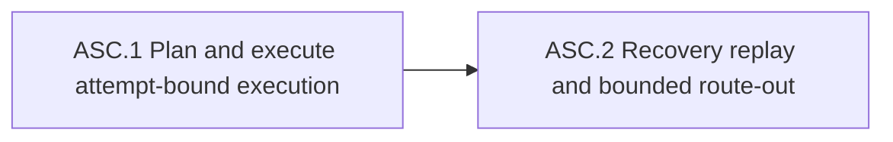

# Make stage circuits attempt-scoped and recoverable — Shape

## Captain Articulation Trail

The captain already supplied the required Mode A forcing answers. This shape
organizes those words and accepted recommendations; it does not re-interview or
reinterpret #21.

**Q1 (Problem and wedge):** What gets worse, and what must continue?
> 真正 agent-native 的工作方式
>
> 繼續 #21 execute

The accepted concrete wedge is the observed recovery livelock: a truthful
partial plan continuation inherited accumulated stage duration and could never
legitimately pass.

**Q2 (Appetite):** How long?
> 2-3天

**Q3 (Out of scope):** Exclude a general scheduler, cross-workflow distributed
coordination, and redesign of #21's technical plan?
> 同意

**Q4 (Critical assumption):** Can attempt-scoped lifecycle unblock #21 without
refactoring the whole dispatch/state model?
> 同意

## Layer 1 — Outcome Card

### Why this scope

This extends the completion seam; schedulers and #21 redesign cannot supply typed attempts.

### Will get

- **W1:** When a plan or execute attempt ends partial, the First Officer can issue one fresh attempt under its own budget while preserving history. (Check: **W1**)
- **W2:** When that attempt resumes, crashes, or replays, the First Officer can preserve its clock and one terminal receipt. (Check: **W2**)
- **W3:** When bounded retry is exhausted, the First Officer can route an explicit outcome instead of dispatching forever. (Check: **W3**)
- **W4:** When the prerequisite lands, #21 can revalidate once without rewriting evidence. (Check: **W4**)

### Won't get

- No scheduler, cross-workflow coordination, split-root work, timer migration, or #21 redesign/waiver.

### Captain Bet (approved 2026-07-22)

**Bet (verbatim)**

> 我希望在 ship 後下一次 dogfood 自我實作時就會立即看到更 agnet-native 的行為，如果沒有則代表方法論不對。

**Approval token (verbatim)**

> 同意：這個 part 的「更 agent-native」限定為 W1–W4；approve

## Layer 2 — Detail

### Problem and acceptance outcome

Ship-plan has an unconditional 20-minute breaker but no typed attempt epoch.
#21 therefore records a technically approved 32-minute partial and a later
unchanged 61-minute revalidation that also must remain partial. Agents cannot
distinguish replay, resume, or a genuinely fresh attempt without inferring
lifecycle from prose.

After this pitch, a post-partial plan or execute continuation can complete under
its own stage-specific budget without resetting resume/replay time, erasing
monotonic history, weakening exact receipt validation, or changing #21's plan.

### Appetite and shaped children

- Appetite: **small-batch, 2-3 days**.
- Fit: **2.3 days of a 3-day cap (77%)**, leaving 23% headroom; each child is at
  most two days.
- **ASC.1 — Plan/execute attempt-bound execution (~1.4d; deps: none).** Start or resume a lease-bound attempt and apply the existing stage-specific breaker only to that attempt.
- **ASC.2 — Recover, replay, and route exhaustion (~0.9d; deps: ASC.1).** Terminalize or replay idempotently, preserve cumulative history, and route bounded retry exhaustion.



### Will-get dogfood checks

- **W1:** Seed a #21-shaped partial whose cumulative duration exceeds 20 minutes; a new `attempt_id` starts, finishes within 20 minutes, reports `passed`, and leaves cumulative duration above 20.
- **W2:** Resume the same attempt, then inject crashes before receipt publication and after publication but before terminalization; replay preserves `attempt_started_at`, refuses lease steal, and yields one counted terminal receipt.
- **W3:** Drive the chosen attempt-count or cumulative-duration bound to threshold + 1; the next action is an explicit routeable outcome and no worker dispatch occurs.
- **W4:** Prove #21's existing 32-minute and 61-minute partial receipts are byte-identical, then revalidate the unchanged five-record plan ledger in exactly one fresh attempt.

### Stated assumptions

```yaml
stated_assumptions:
  - id: A1
    claim: "The existing fail-closed completion lifecycle can be extended or versioned with attempt identity without refactoring the whole dispatch/state model."
    verified_by: codebase-grep
    verification: "Inspect fo-completion-lifecycle.sh and completion-v1.sh lease and exact receipt bindings."
    confidence_at_shape: 95
    criticality: critical
  - id: A2
    claim: "Fresh continuation resets only current-attempt duration; resume and replay preserve the same attempt start and never reset its budget."
    verified_by: design-contract
    verification: "Captain accepted the attempt-scoped lifecycle assumption and the standing SO/EM narrow recommendation."
    confidence_at_shape: 95
    criticality: important
  - id: A3
    claim: "The crash-window double-dispatch and lease-steal warning can be falsified at the shared completion seam without building scheduler behavior."
    verified_by: codebase-grep
    verification: "Map the 2026-07-19 debrief warning to W2 crash-boundary and lease-refusal checks."
    confidence_at_shape: 90
    criticality: important
  - id: A4
    claim: "After the prerequisite lands, one attempt-scoped revalidation can unblock #21 without changing its allocator-authoritative technical plan."
    verified_by: codebase-grep
    verification: "Compare #21 plan and ledger evidence with its 32-minute and 61-minute partial receipts."
    confidence_at_shape: 90
    criticality: important
```

### Pre-mortem

**hidden-dependency:** A covered dispatch path bypasses the shared lifecycle seam and retains prose-only elapsed accounting, so #21 passes while another plan/execute attempt still livelocks.

### Evidence basis

- `ship-plan/SKILL.md:465-471` defines only an unconditional total-stage
  20-minute breaker.
- `entity-body-schema.yaml:715-740,810-832` admits partial plan/execute reports
  and duration metrics but no attempt identity, lifecycle, or split duration.
- `fo-completion-lifecycle.sh:7-31` binds entity, stage, worker, ref, before-SHA,
  token, and exact completion receipt, but no attempt epoch.
- `completion-v1.sh:66-73,217-239` keeps lease/receipt bytes exact and fail-closed;
  compatibility must be explicit rather than optional free-form fields.
- #21's entity `:607-664` preserves approved 32-minute and 61-minute partial
  receipts; its `plan.md:226-247` remains an unchanged partial artifact.
- The 2026-07-19 debrief records crash-window double-dispatch and lease-steal as
  gaps that escaped green suites; W2 imports that warning rather than dropping it.

### Explicit exclusions and rejected alternatives

- **Generic scheduler or cross-workflow distributed coordination** — rejected by
  the captain and unnecessary for attempt identity.
- **Split-root expansion unrelated to attempt identity** — separate topology
  debt with a different rollback surface.
- **Redesign, replan, or waive #21** — its technical plan is complete; a waiver
  would make the breaker advisory and rewriting receipts would destroy audit history.
- **Global timer migration** — v1 covers only plan and execute circuits; shape,
  design, verify, review, and ship behavior remains unchanged this batch.

`rabbit_holes: []` — no deferred feature is required to deliver this wedge.

<!-- section:pm-skill-receipts -->
```yaml
pm_skill_receipts:
  stage: ship-shape
  mode: mode-a
  appetite: small-batch
  compose_guard: passed
  receipts:
    - phase: intake-problem
      delegate: problem-framing-canvas
      required: true
      status: unavailable
      evidence: null
      fallback: inline
      rationale: "Delegate is not installed; captain articulation and live #21 receipts frame the problem."
    - phase: scope-decompose
      delegate: opportunity-solution-tree
      required: true
      status: unavailable
      evidence: null
      fallback: inline
      rationale: "Delegate is not installed; two vertical slices were cut around execution and recovery."
    - phase: assumption-extract
      delegate: pol-probe-advisor
      required: true
      status: unavailable
      evidence: null
      fallback: inline
      rationale: "Delegate is not installed; the accepted no-refactor assumption is the point-of-leverage claim."
    - phase: acceptance-outcome
      delegate: press-release
      required: true
      status: unavailable
      evidence: null
      fallback: inline
      rationale: "Delegate is not installed; acceptance is framed as a fresh attempt completing without audit loss."
```
<!-- /section:pm-skill-receipts -->

## Canonical and contract routing

- **ROADMAP.md:** on captain approval, record this prerequisite as active before
  #21 revalidation; do not patch at this gate.
- **PRODUCT.md:** deliberate skip — internal workflow recovery correctness, no
  new product capability or user-facing constraint.
- **Root README.md:** deliberate skip — no command, flag, install, or quick-start
  surface changes.
- **answers_density:** `high`.
- **Covered stages:** `plan`, `execute`; all retain their existing distinct time
  limits. Shape is outside completion-v1, and no other stage behavior changes.

<!-- section:architecture-impact -->
- target_section: `decisions`
- before: Completion leases and receipts bind entity/stage/worker/ref/Git evidence, while plan and execute reports expose only cumulative prose duration and partial status.
- after: Record FO-issued, lease-bound attempt identity; fresh-versus-resume semantics; terminal/interrupted state; current-attempt versus cumulative duration; idempotent replay; and bounded escalation for plan/execute circuits.
- rationale: The breaker must remain enforceable after truthful partial recovery without making agents infer lifecycle from prose or weakening Git/receipt authority.
<!-- /section:architecture-impact -->

## Domain Registry Validation

- classify: `bash plugins/ship-flow/lib/registry-resolve.sh --classify docs/ship-flow/attempt-scoped-stage-circuits/index.md`
- classify_result: `status=ok matched=schema`
- validate: `bash plugins/ship-flow/lib/registry-resolve.sh --validate --domain=schema`
- validate_result: `status=ok`
- domain: `schema`
- result: `proceed`
- project_routing: project-local domain and skill-routing files are absent; the
  discovery draft was empty, so no adopter-specific specialist is claimed.

### Hand-off to Design

```yaml
affects_ui: false
domain: schema
design_required: true
contract_decision_required: true
ui_surfaces: []
open_design_questions: []
open_contract_decisions:
  - id: CD-1
    decision: "Choose a legacy-safe completion-v1 extension or an explicit completion-v2 receipt, preserving exact fail-closed bytes."
  - id: CD-2
    decision: "Define FO-only attempt ID issuance and authoritative monotonic timing while timestamps remain auditable."
  - id: CD-3
    decision: "Choose the append-only attempt-history home and terminal/interrupted representation with idempotent replay."
  - id: CD-4
    decision: "Choose plan/execute per-stage bound representation and the attempt-count or cumulative-duration escalation threshold without waiving existing budgets."
pm_framing_output: "Inline fallbacks recorded in pm-skill-receipts; captain articulation above is authoritative."
```

## Independent cross-review

The fresh reviewer rated feasibility, quality, canonical sync, and pre-mortem
credibility PASS; executable scope, DC adequacy, and reverse-audit coverage WARN.
The warnings required two repairs: name the v1 covered stages and exercise the
known crash-window/lease-steal failures. This artifact now limits behavior to
plan/execute and W2 covers both crash boundaries plus lease-steal refusal. The
reviewer's conditional result after those repairs is **PROCEED to captain gate**.
All four schema choices remain design-owned; no planner may choose them silently.

## Shape Report

- status: passed
- reviewer_verdict: PROCEED
- captain_gate: approved 2026-07-22
- stage_cost: one fresh L0 fallback plus one independent cross-review
- appetite_fit: 2.3/3 days (77%, passed)
- canonical_sync: ARCHITECTURE decision intent required; PRODUCT and root README deliberate skips

### Metrics

- status: passed
- duration_minutes: 19
- iteration_count: 1
- path: shape+sharp
- open_contract_decisions_count: 4
- domain_matches_count: 1
