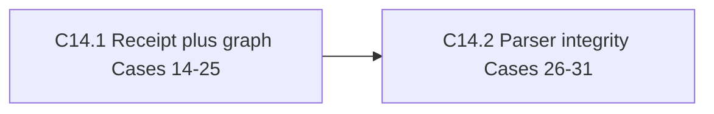

# Shape — Align C14 with First Officer stage-entry transitions

### Summary

Re-shape GitHub #30 as one small-batch, end-to-end C14 receipt + graph + parser slice covering Cases 14–31. Preserve the original dogfood problem, explicitly defer migration/rename, merge, and authenticated-provenance semantics, and stop at the captain gate before any stage advance.

### Captain Articulation and Ownership Trail

Problem provenance is GitHub #30. The captain did not author the proposal and said, verbatim:

> 說實話我不知道，這張票是來自另外的 fo 的提案

After reviewing the recovered problem and adopt-all / narrow / drop choices, the captain decided, verbatim:

> 那就NARROW，剩餘的紀錄到 issue，然後推進

This artifact therefore organizes another First Officer's proposal under the captain's Safe NARROW decision; it does not invent captain framing.

### Problem

GitHub #30 records a concrete dogfood failure: the First Officer legitimately enters a stage with `dispatch: <feature> entering <stage>` (or same-worker `advance: ... entering <stage>`), but C14 recognized only completion-side `advance-stage.sh` signatures. A valid `draft -> shape` dispatch was therefore indistinguishable from a manual frontmatter bypass and blocked feature work before it began.

### Captain Gate Card

#### Will get

- **W1:** When the First Officer enters a declared adjacent or feedback stage, Ship-Flow can accept the narrowly bound receipt without weakening manual-bypass detection. (Check: DC-1, DC-2)
- **W2:** When C14 parses the workflow graph, maintainers can rely on root, bounds, indentation, normalization, and path-scope guards through Case 31. (Check: DC-3)

#### Won't get

- Entity migration, rename, or status-presence correlation (#36); merge-resolution or inherited-parent semantics (#37); or tool-owned receipt provenance (#38).
- RoboRev release handoff #35; it remains separate and cannot expand C14.

#### Why this scope

Safe NARROW restores the original FO dogfood path within three days while moving distinct history-shape and upstream-authentication policies to separately reviewable issues.

#### Captain Bet (mandatory before approve)

`Bet: when this ships, captain expects [observable outcome] within [time window]. If not, this pitch was wrong about [Layer 1 line].`

### Appetite and Shaped Children

- Appetite: **small-batch**, three-day cap.
- Fit: two dependent increments total ~2.2 days, leaving ~0.8 day headroom; 73% of appetite, below the 80% cap. Each child is ≤2 days.
- **C14.1 — Bind FO receipt to legal stage entry (~1.5d; Cases 14–25).** Ship canonical subject/after-stage matching and graph-first direct/feedback validation with RED/GREEN evidence.
- **C14.2 — Bound the workflow parser used by C14 (~0.7d; Cases 26–31; depends on C14.1).** Ship root, bounds, indentation, normalization, and path-scope guards for the graph validator.
- Included chain: C14.1 uses `f8fc638`, `347cfe2`, and `2f4afbe`; C14.2 uses `be5d071`, `4b1b35b`, and only the parser-indentation portion of `cd957c3`.

### Done Criteria

- **DC-1 (value):** A canonical FO `draft -> shape` or declared feedback entry succeeds, while arbitrary/manual and lookalike receipts fail.
- **DC-2 (mechanism):** Receipt matching is subject-only, requires a non-empty summary, binds every mutated entity's after-stage, and leaves completion-side `advance-stage.sh` enforcement intact.
- **DC-3 (mechanism + value):** Every receipt/exemption path crosses the workflow graph first; Cases 14–31 cover receipt, direct/feedback edges, parser root/bounds/indentation/normalization, and C14 path scope.
- **DC-4 (integration):** Targeted C14, invariant, full shell, Node, shellcheck, and diff checks pass without hash allowlists or a forged completion signature.

### Explicit Deferrals

- **#36:** Cases 32–35, 37–43, and 45 — migrations, renames, IDs, and status presence.
- **#37:** Cases 36 and 44 — merge-resolution and inherited-parent transitions.
- **#38:** upstream/tool-owned, machine-readable FO receipt provenance.

### Rejected Alternatives

- **Adopt all through Case 45:** rejected because it breaches the small-batch appetite and mixes receipt, migration, merge, and upstream-authentication policy surfaces.
- **Drop the repair:** rejected because the original legitimate FO dogfood transition remains blocked before feature work starts.

### Stated Assumptions

| ID | Criticality | Confidence | Claim | Verification |
| --- | --- | ---: | --- | --- |
| A1 | critical | 85% | Subject-only v1 receipts plus graph/parser checks are an acceptable bounded interim, not authenticated provenance. | `skill-source-read`: INVARIANTS v1 limitation and explicit dependency #38 |
| A2 | important | 90% | Parser guards through Case 31 are load-bearing for trustworthy edge validation. | `codebase-grep`: Cases 19–31 and source chain |
| A3 | important | 85% | Cases 30–31 can be separated from `cd957c3` without importing its migration behavior. | `codebase-grep`: commit diff separates indentation hunks from Cases 32–34 |

### Pre-mortem

**hidden-dependency:** Spacedock changes its commit-subject grammar without a coordinated contract update, recreating the mismatch despite Cases 14–31 passing.

### Canonical and Registry Impact

- **PRODUCT.md:** deliberate skip; this repairs internal pipeline correctness without adding a durable user-facing capability or constraint.
- **README.md:** deliberate skip; no command, flag, environment variable, installation, or quick-start behavior changes.
- **ROADMAP.md:** on captain approval, add this small-batch entity to Next/active-stage tracking; do not patch canonical docs during shape.
- **Domain Registry Validation:** classify returned `status=ok`, `matched=schema`; validate `--domain=schema` returned `status=ok`. Project-local domain and skill-routing files are absent, so no adopter-specific specialist is claimed.

<!-- section:architecture-impact -->
- target_section: `decisions`
- before: ARCHITECTURE records the pipeline and `advance-stage.sh` mutation path but no distinct FO stage-entry receipt contract.
- after: Add a decision recording FO stage entry and completion advancement as separate sanctioned paths, graph-first validation for all paths, and v1 provenance authentication deferred to #38.
- rationale: C14 enforcement and the First Officer must share one durable transition contract without claiming author authentication the current receipt cannot prove.
<!-- /section:architecture-impact -->

### Hand-off to Design

- `ui_surfaces: []`
- `open_design_questions: []`
- `open_contract_decisions: []` — Safe NARROW already fixes the v1 boundary; authenticated provenance is deferred intact to #38.
- `pm_framing_output:` GitHub #30 plus the verbatim captain ownership/decision trail above.

### Independent Cross-review

First pass VETO: feasibility FAIL; quality and canonical sync WARN. After re-cutting into two ≤2-day children, adding explicit rejected alternatives, and structuring ARCHITECTURE intent, the same reviewer rated all seven factors PASS. Final verdict: **PROCEED to captain gate**.

### Shape Report

- PM delegate fallback: `problem-framing-canvas`, `opportunity-solution-tree`, `pol-probe-advisor`, and `press-release` are not installed; issue evidence, commit/case dependency analysis, the critical provenance boundary, and observable DCs were applied inline.
- status: passed
- duration_minutes: 35
- iteration_count: 1
- path: shape+sharp
- open_contract_decisions_count: 0
- domain_matches_count: 1
