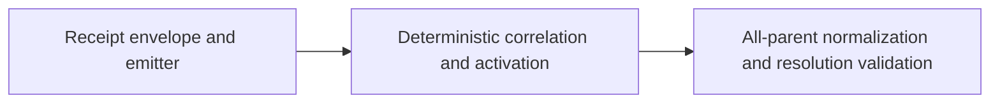

Replace heuristic entity-migration correlation with a deterministic sanctioned
contract, and define merge-parent semantics that validate resolution-only status
changes without re-requiring receipts for transitions inherited unchanged from
another parent.

## Acceptance criteria

**AC-1 — Entity migration identity is deterministic rather than content-similarity based.**
Verified by: a mechanically validated migration receipt or stable identity contract accepts intentional path/ID migrations and rejects ambiguous retirement-plus-addition histories without relying on Git rename percentage.

**AC-2 — Merge status validation distinguishes inherited state from resolution-only mutation across all parents.**
Verified by: regression fixtures cover ordinary inherited merges, an entity absent from the first parent but present in another parent, and a resolution status that differs from every parent.

**AC-3 — After the FO-owned lifecycle prerequisite is reconciled, the C14 branch can produce a fresh exact-head RoboRev receipt with no medium-or-higher code finding.**
Verified by: the prerequisite's sanctioned transition receipt, targeted C14 tests, full invariant/shell/Node gates, and a `code_completion` panel whose reviewed head equals the branch head.

<!-- section:pm-skill-receipts -->
```yaml
pm_skill_receipts:
  stage: ship-shape
  mode: mode-a
  appetite: medium-batch
  compose_guard: passed
  receipts:
    - phase: intake-problem
      delegate: problem-framing-canvas
      required: true
      status: unavailable
      evidence:
      fallback: inline
      rationale: RoboRev job 40 and the dispatch end value provide a concrete falsifier-grounded problem.
    - phase: scope-decompose
      delegate: opportunity-solution-tree
      required: true
      status: unavailable
      evidence:
      fallback: inline
      rationale: The dispatch completion checklist fixes the two independently valuable seams and their boundary.
    - phase: assumption-extract
      delegate: pol-probe-advisor
      required: true
      status: unavailable
      evidence:
      fallback: inline
      rationale: The critical receipt-identity assumption is isolated and handed to design for falsification.
    - phase: acceptance-outcome
      delegate: press-release
      required: true
      status: unavailable
      evidence:
      fallback: inline
      rationale: The dispatch end value supplies the observable C14 outcome without expanding product scope.
```
<!-- /section:pm-skill-receipts -->

## Dispatch Articulation Trail

This shape organizes the First Officer dispatch rather than inventing a wider
brief:

- **Problem:** RoboRev job 40 showed that Git similarity can invent or miss
  migration identity, and that first-parent-only classification misses an
  entity present only in another merge parent.
- **Wedge:** “Cut the contract to the smallest deterministic migration identity
  that replaces Git similarity without confusing retirement plus addition.”
- **Outcome:** “C14 can distinguish sanctioned entity migration and genuine
  merge-resolution status changes without heuristic identity or duplicate
  receipt failures.”
- **Boundary:** shape/design only; no C14 implementation, old-entity lifecycle
  mutation, hook installation, or required RoboRev gate.

## Acceptance Outcome

When C14 inspects entity history, a maintainer can explain every cross-path
migration from one exact sanctioned receipt and every merge status decision
from the complete parent set. Ordinary inherited merges remain receipt-free,
while a novel merge-resolution status cannot hide behind parent ordering or a
Git similarity score.

## Appetite

`medium-batch` — eight working days inside the 1-2 week band. The initial two-slice
cut omitted the convenience emitter, activation compatibility, and the
normalization/validation seam identified by independent review and RoboRev job
41. Receipt authentication, a general event ledger, and RoboRev gate promotion
remain explicitly outside the budget.

## Children and Appetite Fit

Design ratification is a prerequisite for every execution child; no child
implements a provisional choice.

- **C1 — Bounded carrier parser** (`~0.75 day`, deps: design): ratified grammar,
  limits, and stable diagnostics parse independently.
- **C2 — Receipt emitter** (`~0.75 day`, deps: C1): the convenience emitter
  produces parser-equivalent rows and refreshes parent bindings.
- **C3 — Operation semantics and scan activation** (`~1.5 days`, deps: C2):
  migrate/retire/create accounting is deterministic without retroactive
  main-history failure.
- **C4 — Per-parent normalization** (`~1.5 days`, deps: C3): explicitly mapped
  sources produce one order-independent logical state set.
- **C5 — Resolution legality and canonical proof** (`~1.5 days`, deps: C4): the
  ratified novel-result policy, exact-head falsifier, and architecture decision
  land together.

The six-day implementation sum plus two days of review/falsifier iteration fits
the explicit eight-day appetite. Planning and implementation are blocked until
design ratifies the decisions named in the hand-off.

### Will get

- **W1:** When an entity changes path, layout, or frontmatter ID, maintainers
  can bind exactly one before path to exactly one after path without content
  similarity. (Check: W1 in `Will-get dogfood checks`.)
- **W2:** When a merge result inherits an entity state from any parent,
  maintainers can merge it without manufacturing a duplicate transition
  receipt. (Check: W2 in `Will-get dogfood checks`.)
- **W3:** When a merge creates a status different from every parent that
  contains the entity, C14 can validate the new transition independent of
  parent order. (Check: W3 in `Will-get dogfood checks`.)
- **W4:** When the repaired C14 head is reviewed, the captain can inspect a
  fresh exact-head RoboRev panel with no medium-or-higher finding after the FO
  lifecycle prerequisite is reconciled. (Check: W4 in `Will-get dogfood
  checks`.)

### Won't get

- No cryptographic proof that a receipt was emitted by Spacedock; current
  commit-message provenance remains structurally validated, not authenticated.
- No permanent acceptance of frontmatter ID, normalized layout, or Git rename
  percentage as sufficient cross-path identity.
- No pre-commit/pre-push hook and no required RoboRev CI gate.
- No lifecycle repair for `c14-fo-dispatch-contract`; FO owns that separate
  sanctioned transition.

### Why this scope

An exact operation receipt plus all-parent state comparison closes both job-40
findings. A durable global UUID system or general workflow event ledger would
expand migration, creation, and provenance policy beyond this C14 repair.

## Contract Alternatives

| Approach | Benefit | Loss function | Shape decision |
| --- | --- | --- | --- |
| Immutable frontmatter ID | Small comparison surface for already-ID-bearing entities | Legacy entities and intentional ID changes still need an escape hatch; ID reuse can confuse retirement plus addition | Reject as the sole contract |
| Exact commit-bound parent-qualified sources → one result receipt | Handles path, layout, ID, and content changes without inference | Requires carrier/emitter grammar and a rule for mixed add/delete commits | **Recommend** |
| Blob-OID lineage receipt | Strongly binds exact content snapshots | Duplicates identity already supplied by commit plus path, complicates rewrites, and adds no status-transition authority | Reject as overbuilt |

## Shaped Contract

Shape fixes the semantic boundary below. Carrier syntax and the divergent-parent
legality algorithm are explicit design decisions; normative implementation must
not begin until design ratifies them.

### M1 — Deterministic migration identity

1. A cross-path entity migration exists only when the inspected commit carries
   one mechanically valid receipt binding workflow identity, one or more
   parent-qualified source paths, and one exact result path. A single-parent
   commit has one implicit source parent; a merge lists every parent whose old
   path contributes to the logical entity.
2. Within each parent, a source path may occur in at most one operation; in the
   result tree, an after path may occur in at most one operation. Duplicate,
   cross-workflow, nonexistent-source, and nonexistent-destination claims fail
   closed. Multiple explicitly listed parents may converge to the one result;
   no unlisted parent acquires cross-path identity.
3. Every before path is resolved in its listed parent tree and the after path
   in the commit tree. The inspected commit plus parent OIDs supplies the
   revision boundary, so blob hashes are not part of the minimal identity.
4. A commit containing both unpaired entity deletions and additions in the same
   workflow is ambiguous. It must account for every path with either a
   migration pair or explicit independent `retire`/`create` disposition, or
   split genuine retirement and creation into separate commits. In a
   single-parent commit, pure addition-only and deletion-only histories retain
   their existing exemption. Merge commits use the completeness rule below.
   Independent dispositions are an explicit structural waiver, not proof that
   two operations are unrelated. They prevent accidental ambiguity but cannot
   stop a committer who intentionally authors a false receipt under the current
   unauthenticated provenance contract.
5. Completeness is derived globally from M2's normalized all-parent logical
   states, not independently from each parent path diff and not self-declared.
   C14 first computes no-rename entity-path diffs for every direct parent and
   checks raw mapping coverage before applying inheritance. Once a receipt
   names a source path for a result-bearing logical feature, every direct parent
   where that named source path exists in the parent but is absent from the
   merge result must either be in
   the receipt's source set or classify that deletion as an independent
   `retire`; it cannot be split into a new feature and hidden by another
   parent's absence. A parent whose same source path remains in the result has
   no deletion candidate and needs no operation row. An omission fails
   `receipt-incomplete`.
   C14 then applies the explicit mappings and forms one logical feature from
   the result path plus exactly those mapped source paths. Other unmapped paths
   remain separate logical features. It normalizes each feature across all
   direct parents before deriving any remaining operation candidate:
   - A present result whose logical feature is absent from every parent is the
     only derived `create` candidate.
   - A present result for a logical feature present in any parent is inherited
     when its state matches a parent, or resolution-only when its status is
     novel. Status novelty never creates a `create` or `migrate` candidate;
     cross-path identity still requires an explicit `migrate` mapping.
   - An absent result derives a `retire` candidate unless at least one parent
     contributes an inherited-absence proof: a validated earlier retirement of
     the same logical generation in the active scan range. Every entity present
     in the trusted boundary tree starts an implicit baseline generation keyed
     by `(boundary_oid, workflow, path)`; an in-range validated appearance or
     `create` starts a generation keyed by `(commit_oid, workflow, after_path)`.
     An explicit migration preserves that key and a validated retirement closes
     it. A later create at the same path starts a new generation and cannot
     reuse the prior generation's retirement proof. These keys are computed
     scan state, not receipt fields or user-authored identity. Mere
     never-presence in an older or unrelated parent has no feature lineage and
     cannot suppress a retirement candidate.
   Explicit `migrate`, `retire`, and `create` rows are never discarded by this
   suppression: every supplied source/result is still resolved, classified
   exactly once, and checked for duplicate classification, omitted mapped
   sources, and `parent-path-collision`. Any operation candidate left
   unclassified fails `receipt-incomplete`. This preserves explicit identity
   and collision rules while preventing a per-parent path diff from
   reclassifying an inherited absence or a resolution-only status as an
   operation.
   This suppression cannot manufacture an unreviewed deletion: absence carries
   lineage only from an already validated in-range retirement of the same
   generation, never from a retired predecessor at a reused path, parent
   ordering, a missing path snapshot, or an unscanned legacy commit. A missing
   parent, tree, or required in-range history segment fails loud; it never
   counts as inherited absence.
6. Layout identity, equal frontmatter ID, and Git rename similarity may produce
   diagnostics, but none may establish migration identity or authorize a
   transition.
7. A migration or generation-reconciliation receipt only correlates identity.
   If status changes across any source/result pair, the normal workflow-graph
   and stage-entry/completion receipt checks still apply.
8. Divergent computed generations at one exact path may converge only through
   already validated retirement provenance or one explicit `reconcile` row.
   `reconcile` lists every parent carrying a divergent generation at that path
   and selects exactly one listed parent's generation for the result. It is an
   explicit unauthenticated
   equivalence waiver for cherry-pick/backport histories, never inferred from
   ID, layout, content, or patch similarity; a false alias has the same stated
   trust limit as a false independent disposition.
9. Every source in one multi-parent `migrate` row must carry the same computed
   generation key. Explicit migrations may preserve that one key across
   different parent paths, but may not choose among divergent keys. Divergent
   generations must be reconciled at one exact path or pre-aligned before the
   cross-path migration; otherwise C14 fails `generation-conflict`.

#### Provisional semantic envelope for design ratification

The carrier may be a commit trailer or another commit-bound surface, but after
parsing it must yield these fields. Design may change spelling, not meaning:

| Field | `migrate` | `retire` | `create` | `reconcile` |
| --- | --- | --- | --- | --- |
| `version` | required, exactly `1` | required | required | required |
| `operation` | `migrate` | `retire` | `create` | `reconcile` |
| `workflow` | required workflow slug | required | required | required |
| `sources[]` | non-empty `(parent_oid, before_path)` set; at most one source per parent; sole parent may be implicit | non-empty source set | forbidden | every divergent `parent_oid`; C14 resolves each computed generation at `after_path` |
| `after_path` | required | forbidden | required | required; sole lookup/result path for every source parent |
| `selected_source` | forbidden | forbidden | forbidden | required `parent_oid`; exactly one member of `sources[]` |

All paths are normalized repository-relative paths under the declared
`docs/<workflow>/` root: no absolute path, `..`, empty segment, workflow escape,
or README target. A source classification key is `(parent_oid, path)` and may
occur exactly once per commit; the same path string in different parents may be
classified separately. A result path may occur in only one operation. The
number of non-`reconcile` operation rows cannot exceed the changed entity-path
count. `reconcile` is exempt because identical-content parents can have
different computed generations without a Git path diff; it is instead capped
at one row per exact result path whose direct parents expose at least two
generation keys. Unknown version, unknown field, malformed row, duplicate
classification, listed parent not in
the commit's parent set, missing before blob, missing after blob, or wrong
workflow fails before status validation. Design owns the exact line-length and
message-size spelling; the shaped bound is 8 KiB per row and 64 KiB total
receipt carrier, with an earlier changed-path-count cap.
One operation cannot list more sources than the commit has parents.
For `reconcile`, C14 resolves each listed parent's computed generation at
`after_path`; users never transcribe generation keys. The source set must cover
every divergent generation at the path, and the result inherits the selected
parent's key and already validated status. Non-selected statuses follow the
same inherited-state rule as same-generation parents: they are not
source-to-result edges, while an unvalidated selected status fails before
aliasing. A missing, duplicate, or partial alias fails `generation-conflict`.
Aliasing never authorizes a new status.

The provided emitter is a convenience and preflight validator, not an
authority. Because C14 cannot authenticate its caller, manually authored syntax
that is byte-for-byte semantically equivalent is accepted. Rebase or cherry-pick
changes parent OIDs and therefore invalidates merge-source bindings; the emitter
must refresh them before review rather than C14 guessing ancestry. `reconcile`
rows are refreshed from the rewritten parent OIDs and C14 recomputes their
generation keys; no stale key is copied through the rewrite.

#### Activation and legacy compatibility

The new contract is scan-bound, not retroactive. C14 resolves
`git merge-base --all origin/main HEAD`, requires exactly one boundary OID, and
inspects only `boundary..HEAD`; when `origin/main` exists, zero boundaries fail
`scan-boundary-unavailable` and multiple best boundaries fail
`scan-boundary-ambiguous` rather than choosing nondeterministically. The
existing no-`origin/main` fixture skip remains separate. Main-history
migrations before the new checker lands are never revisited. Any in-range
mixed delete/add commit is
subject to v1 and must be amended with operation rows or split. A branch forked
before activation must rebase onto the new main and repair its still-unmerged
in-range commits; Git similarity is not retained as a grandfather path. After
the review range is selected, a missing required parent/tree object fails loud
rather than being treated as absence.

Receipt v1 is provisional and unimplemented until design ratification and the
activation commit; therefore no deployed v1 `reconcile` row exists to migrate.
Any incompatible schema change after activation requires a new version rather
than reinterpretation of accepted rows.

`origin/main` is the existing C14 protected-target contract and remains fixed
for this repair; configurable release/hotfix targets are separate policy work,
not an implicit environment override. An ambiguous best-base failure names all
candidate OIDs and instructs the branch owner to rebase or squash onto the
protected target to restore one boundary. No override may select a convenient
base and silently exclude commits from validation.

The selected scan boundary, not a pairwise or octopus merge base, also bounds
absence provenance. C14 validates commits in the selected range in topological
order and carries forward only operation outcomes it has already validated.
The carried state includes the current logical generation, so a later create at
a reused path resets absence provenance. An in-range parent retirement can
therefore supply inherited-absence proof only to the same generation at a later
merge. A parent outside the selected range contributes its tree snapshot as the
trusted baseline but no retroactive retirement proof; baseline absence is never
enough to suppress an in-range retirement candidate. Criss-cross and octopus
merges require no additional merge-base selection, and pre-activation commits
are neither traversed for receipts nor failed for lacking them.

Diagnostics use stable categories so fixtures assert causes rather than prose:
`receipt-missing`, `receipt-malformed`, `receipt-conflict`,
`receipt-semantic-invalid`, `receipt-incomplete`, `parent-unavailable`,
`parent-path-collision`, `generation-conflict`, `scan-boundary-unavailable`,
`scan-boundary-ambiguous`, and `transition-illegal`.
Design supplies exact messages and carrier bounds. Every
completeness/collision diagnostic identifies
the inspected merge OID, logical result path or absent-result unit, contributing
parent OID, authoritative lookup path, and derived candidate category, so an
operator can repair the specific mapping rather than guess which parent diff
failed.

This is the smallest contract that both recognizes a simultaneous path/ID
change and refuses to guess whether an unrelated deletion plus addition is a
migration.

### M2 — Recommended multi-parent merge semantics (design ratification required)

For merge commit `M`, define each entity path state in every parent as
`absent` or `present(status)`. Apply a valid M1 source mapping only to the
parents explicitly listed by that operation. A source path named anywhere in
that operation is also a raw-coverage probe in every unlisted parent only when
that path is absent from the merge result; parent presence then represents a
deletion and must be explicitly classified before logical normalization. If
the merge result retains that same path, it is an unchanged separate feature,
not a deletion candidate. Other unlisted old-path occupants are unrelated and
remain separate features.
For a result-bearing feature, an exact result-path occupant in an unlisted
parent is the same workflow path slot and participates unless that path is
already claimed by a different operation, which fails `receipt-conflict`.
Frontmatter ID, content, and layout never override either exact-path continuity
or an explicit parent-qualified mapping.

C14 protects lifecycle state for that exact workflow path slot, not body
identity or full-content provenance (A2). Two parent occupants at the same
exact path are therefore one logical slot for C14 unless scan-state generation
records prove a retire-then-create boundary; same-status body replacement is
outside this repair. Conversely, a migration target occupied in an unlisted
parent cannot be simultaneously retired and overwritten by claiming that path
in a second operation: the claims fail `receipt-conflict`. This fail-closed
case is intentional because multiple unrelated old entities converging on one
result is out of scope. The actionable remedy is to pre-align/retire the target
on its branch or choose an unoccupied target path before the merge, not infer
identity from ID, layout, or content.

When direct parents carry different computed generations at the same path,
C14 normalizes each generation separately. For result generation G-selected,
every non-selected generation G-other must have either exact validated
retirement provenance in another parent's scan state or complete coverage in a
`reconcile` row that selects G-selected. This rule is symmetric: selecting an
older, newer, or cherry-picked generation changes no obligation. Without that
proof or explicit alias, the merge fails `generation-conflict` and must
pre-align the parents. A valid `reconcile` makes the result carry the selected
generation key and its already validated status. Non-selected statuses are
handled exactly like non-matching same-generation parent states: selecting a
validated parent state is inheritance, while aliasing cannot create a novel
status.
Generation equality never follows from equal path, ID, layout, status, or body;
it follows only from the shared baseline/create key carried through explicit
migrations or an explicit `reconcile` waiver.

“Relevant parents” means all direct Git parents of `M`, never a caller-selected
subset. For one logical feature, each direct parent contributes exactly one
authoritative lookup: its explicitly listed source path when that parent is in
the feature's migration/retirement mapping, otherwise the exact result path.
For an absent-result operation that can name different source paths per parent,
the lookup map is parent-specific: a listed parent uses its listed path; an
unlisted parent probes every distinct source path named by that operation.
Zero occupants normalize to absent, one to that occupant's state, and more than
one fails `parent-path-collision`. Mapped source paths plus the result path
define only that logical feature; an unmapped path is normalized separately
and cannot be absorbed by similar content, status, or ID.

Per parent, normalization is order-independent:

1. For a listed parent, inspect its listed source path and any result path. For
   an unlisted parent, inspect the exact result path for a result-bearing unit,
   or apply the absent-result source-probe rule above.
2. No authoritative path exists → logical state `absent`.
3. Exactly one authoritative path exists → logical state `present(status)`.
4. Both authoritative source and result paths exist in a listed parent → fail
   `parent-path-collision`; C14 does not infer that two blobs are one entity,
   even if IDs, status, or content match.
5. Deduplicate identical normalized states only after every parent is
   classified; retain the contributing parent set for diagnostics.

Different listed parents may provide different old paths in the same operation;
their explicit parent-qualified mappings normalize to one logical comparison
set. A named source path found in an unlisted parent triggers raw coverage; an
unnamed old path remains unrelated and cannot create an inferred identity. The
probe triggers only when the named source path is absent from the result; an
unchanged retained path needs no receipt.

1. **Inherited:** if `M`'s present result state equals the state in any direct
   normalized parent, the result is inherited. An absent result is inherited
   only from a parent whose absence carries the validated in-range retirement
   provenance defined by M1.5; never-presence is not inheritable. C14 does not
   require a duplicate transition or operation receipt for the matching
   parent's unchanged state. Before applying that suppression, every explicitly
   mapped source independently validates its own source-status → result-status
   edge and stage-entry/completion receipt under M1.7; all mapped edges must
   pass, and one legal parent cannot mask an illegal one. Thus a mapped `shape`
   source does not bypass `shape -> plan` validation merely because an unlisted
   parent already has the result path at `plan`. Any explicit operation row
   remains fully validated rather than being erased by inheritance.
   For same-generation, same-path parents with different statuses and no
   mapping, an inherited result also requires the matching parent's status
   provenance: either its in-range transition already passed C14 earlier in the
   topological scan or the status is the trusted boundary state. The
   non-matching parent's status is not a source-to-result edge because the merge
   selected another parent's already validated state; it cannot mask an
   unvalidated matching state. If the result matches no validated parent state,
   it is resolution-only and the ratified every-parent legality rule applies.
2. **Pure addition:** a result is a pure addition only when the logical entity
   is absent from every parent at the result/source path and no migration
   receipt names a source in any parent.
3. **Resolution-only:** when a present result differs from every normalized
   present-parent state and the logical entity exists in at least one parent,
   the merge introduced a new status on an existing logical feature. It is not
   creation or migration. Absence contributes no graph edge. A result absent
   from a present parent is a retirement unless a different parent's absence
   supplies validated retirement provenance, as M1.5 specifies.
4. **Recommended legality rule:** the result must be a declared direct next or
   feedback transition from every distinct present-parent status, and the merge
   commit carries one transition receipt bound to the resulting stage. This is
   fail-closed and parent-order-independent, but remains unratified because job
   40 proves first-parent-only wrong without proving direct-edge-from-every-parent
   is the only valid reconciliation policy.
5. Design must ratify the recommendation or replace it with one fully specified
   alternative: graph reachability, or a receipt-selected provenance parent
   plus explicit reconciliation checks for every other present parent. Plan
   must not choose. Any ratified option must have identical verdicts under
   parent permutation and cannot let one convenient parent silently mask
   another. Until that ratification lands, implementation is blocked and the
   existing C14 behavior remains in force; “resolution-only” is a
   classification boundary, not permission to skip transition validation.

The job-40 absent-first-parent case therefore reduces deterministically:
`P1=absent`, `P2=present(shape)`, `M=present(shape)` is inherited; the same
parents with `M=present(plan)` are resolution-only and must prove the
`shape -> plan` edge plus one merge transition receipt.

The complementary inherited-absence case is also global:
`P1=present(shape)`, `P2=absent`, `M=absent` is inherited absence and derives
no duplicate `retire` candidate only when P2's in-range history contains the
already validated retirement of that logical feature. If P2 merely never had
the feature, P2 has no absence provenance and M must classify P1's deletion. If
the merge nevertheless carries an explicit retire row, that row still must
resolve every listed source and pass all coverage and collision checks. An
absent parent with unavailable or unvalidated required history fails loud.

## Will-get dogfood checks

- **W1:** RED/GREEN fixtures cover a low-similarity path+ID migration with one
  exact receipt, the same migration without a receipt, duplicate/one-to-many
  receipts, an unrelated retirement plus addition with explicit independent
  dispositions, and the ambiguous equivalent with neither dispositions nor a
  split commit.
- **W1 trust boundary:** a same-ID or visually similar pair independently
  disposed as retire/create is accepted as an explicit unauthenticated waiver;
  a false `reconcile` alias has the same limit. Fixtures and documentation must
  call both intentional structural-policy scope, not adversarial protection.
- **W1 completeness:** a merge omitting a parent-side deletion from its source
  set fails `receipt-incomplete`; explicitly classifying that candidate as
  independent retirement is accepted only as the documented structural waiver.
  The matrix includes a deletion where the result path already exists in every
  parent: the result is inherited, but the separate disappearing old path still
  requires `migrate` or `retire` classification. The same path string may be
  `(P1,path)` in a migration and `(P2,path)` in an independent retirement;
  duplicating either parent-qualified key fails. It also includes
  `P1=present(shape), P2=absent-after-validated-retire, M=absent`: global
  normalization classifies the result as inherited absence and derives no
  duplicate retirement candidate. The negative twin makes P2 never-present
  and requires M to classify P1's deletion. A second negative twin retires one
  generation, recreates a new generation at the same path on P1, and proves the
  old retirement cannot suppress deletion of the new generation. Explicit
  source mappings in all cases still undergo raw coverage, resolution,
  uniqueness, and collision validation. A baseline legacy entity receives the
  implicit boundary generation; a merge with G1/G2 at the same path passes only
  when every non-selected generation has exact retirement provenance or a
  complete explicit `reconcile` alias, otherwise it fails
  `generation-conflict`. Cherry-picked/backported creates with different commit
  keys fail without the alias and pass with a complete alias selecting either
  generation when the selected status has validated provenance. Divergent
  non-selected statuses follow ordinary inherited-state semantics; a novel or
  unvalidated selected status fails. No content/ID inference is accepted.
  Identical-content divergent parents prove `reconcile` remains allowed when
  Git reports zero changed entity paths, while more than one row for that exact
  divergent path fails the dedicated cap.
- **W1 compatibility:** a pre-contract migration reachable only in main history
  is not scanned; an unmerged in-range legacy migration fails with an actionable
  amend/split diagnostic rather than falling back to similarity.
- **W2:** A no-conflict merge and an absent-first-parent merge whose result
  equals the second parent pass without a merge transition receipt; the same
  inherited transition is not reported twice. A same-generation
  `P1=shape, P2=plan, M=plan` case passes only after P2's `plan` provenance is
  validated (or trusted at the boundary); an unvalidated matching state fails
  before inheritance.
- **W3:** Fixtures permute parent order and cover a result different from every
  parent. They also cover source-only, result-only, neither-path, and both-path
  collision normalization in listed parents, plus unrelated source-path
  occupants in unlisted parents. The matrix includes
  `P1=absent, P2=present(shape), M=present(plan)` and proves it is
  resolution-only—not create or migrate. That classification fixture is
  executable independently. Its separate legality assertion, including the
  `shape -> plan` verdict, is explicitly deferred until design ratifies the
  policy and supplies the final pass/fail matrix. A mapped-source variant proves
  M1.7 still validates the mapped source edge even when another parent already
  has `present(plan)`. A two-mapped-parent case with different statuses requires
  both source edges to pass and fails when either edge is illegal. Design is the
  immediate next stage and must ratify the policy before plan, so these
  execute-stage assertions have no dependency cycle.
  A multi-parent migration with one shared generation across different old
  paths preserves that key; divergent source generation keys fail before any
  result key can be selected.
- **W4:** After design ratifies the legality policy and execute implements all
  W1-W3 assertions, run targeted C14 fixtures and the unmodified full
  invariant/shell/Node gates; those local gates do not inspect the sibling
  entity's lifecycle state and require no mock or override. Then run a
  `code_completion` panel whose reviewed head equals branch HEAD and whose
  synthesis contains zero medium-or-higher finding. Before that final panel,
  FO must reconcile the stale
  `c14-fo-dispatch-contract` lifecycle through its sanctioned transition path;
  this pitch neither edits nor bypasses it. The advisory panel is invoked once
  at W4 after that receipt; it is not a per-commit CI check, so earlier developer
  commits keep their ordinary local/CI signal rather than producing expected
  red panel runs. FO invokes and records the panel's job ID plus reviewed SHA in
  the verify artifact, and ship-review refuses a GO verdict without that exact
  receipt. This is Ship-Flow enforcement, not a new required GitHub status
  check or hook.

## Mechanism-to-Value Evidence Matrix

| Mechanism criterion | Reproducible value evidence |
| --- | --- |
| Explicit parent-qualified source set is the only cross-path identity | A low-similarity intentional migration is correlated; unrelated delete/add content is never similarity-paired |
| Mixed operations require pair or explicit dispositions | Legitimate retirement plus creation is distinguishable from accidental ambiguity; a false disposition is documented as an unauthenticated waiver, not hidden protection |
| Raw mapping coverage precedes globally normalized all-parent logical states | An omitted named source fails before inheritance; a novel status stays resolution-only; only an already validated in-range retirement suppresses a duplicate retirement candidate |
| Explicit generation reconciliation covers every divergent computed key | Cherry-picked creates can converge without ID/content inference, while a partial or invented alias fails `generation-conflict` |
| Receipt correlation does not authorize status | A receipt-bearing skipped stage still fails the workflow graph |
| Scan-bound activation | Existing main history is not retroactively rejected, while every still-unmerged ambiguous commit is repaired explicitly |
| Result equal to any parent is inherited | Ordinary merge and absent-first-parent inheritance pass without duplicate receipt |
| Pure addition checks every parent | Job 40's absent-first-parent status mutation enters graph and receipt validation |
| Every parent normalizes before legality | Source/result collisions fail deterministically and parent permutations produce the same state set |
| Design-ratified novel-result rule | Parent permutations have identical verdicts and one legal parent cannot silently mask another |

## Scope

### In

- Exact operation-receipt identity and validation invariants.
- Same-workflow migration/retire/create accounting for mixed commits.
- Scan-bound activation behavior for unmerged legacy commits.
- All-parent inherited, pure-addition, and resolution-only state semantics.
- RED/GREEN fixtures for job 40 and receipt ambiguity.
- Fresh exact-head advisory RoboRev proof after normal deterministic gates.

### Out

- Receipt signature/authentication or cross-repository Spacedock provenance.
- General creation, deletion, or event-ledger redesign.
- Multiple unrelated old paths converging into one merge result.
- Required RoboRev policy, hooks, or auto-fix/refine.
- Direct status mutation of any workflow entity.

## Stated Assumptions

- **A1 (critical, 80%)**: Exact commit-bound path pairs plus an ambiguity rule
  are sufficient to represent sanctioned entity migrations without a global
  immutable identifier. `verified_by: codebase-grep`; job-40 and Cases 43-45
  show the current inference boundary, while design must falsify legacy and
  merge-path edge cases.
- **A2 (important, 90%)**: Comparing `(existence, status)` across every parent
  is enough for C14 because C14 protects lifecycle state, not full body-content
  provenance. `verified_by: codebase-grep`.
- **A3 (critical, 70%)**: Requiring a resolution-only result to be legal from
  every present-parent status is an acceptable fail-closed policy; rare
  divergent states can be aligned before merge. `verified_by: design-contract`;
  design must compare direct-edge, graph-reachability, and declared-provenance
  alternatives before ratification.
- **A4 (important, 100%)**: A structural commit receipt cannot authenticate its
  emitter under the current Spacedock contract. `verified_by: codebase-grep`.
- **A5 (critical, 80%)**: Binding every contributing merge parent to an exact
  old path in one result operation is sufficient; unlisted old-path occupants
  are unrelated and must not enter C14's logical state set. `verified_by:
  design-contract`.
- **A6 (important, 90%)**: Scan-bound activation avoids breaking accepted main
  history while it is acceptable to require still-unmerged branches to amend
  ambiguous commits. `verified_by: codebase-grep`.

## Rejected Alternatives

- Lower or tune Git rename similarity — retains both false-pair and missed-pair
  failure modes exposed by job 40.
- Treat equal normalized layout as identity — deterministically confuses a
  same-slug retirement plus folder addition.
- Treat frontmatter ID as always immutable — conflicts with legacy/no-ID and
  intentional ID-repair histories already covered by C14 fixtures.
- Require every legitimate retirement plus creation to use separate commits —
  deterministic but needlessly breaks atomic maintenance; explicit independent
  dispositions preserve intent without guessing.
- Validate a novel merge result against only the first or any one parent —
  makes correctness depend on parent order or permits one legal edge to mask an
  illegal rollback from another parent.
- Add cryptographic receipt provenance now — requires a coordinated Spacedock
  contract and exceeds the bounded C14 repair.
- Claim independent dispositions prevent a malicious committer — impossible
  under the explicitly unauthenticated structural receipt boundary; they are a
  visible sanctioned waiver.

## Pre-mortem

`wrong-dcs`: fail-closed parent provenance or mixed-operation rules reject
legitimate merges and retirement-plus-creation histories because compatibility
cases were under-specified.

## DAG



## Dependencies

- **Pre-final-panel FO dependency:** advance
  `c14-fo-dispatch-contract` through the sanctioned lifecycle mechanism so job
  40's third, non-code stale-state finding cannot contaminate AC-3. This shape
  does not perform or simulate that transition. It is a blocking prerequisite
  owned by FO, not a child of this entity: design and implementation may
  proceed and the deterministic local gates can run independently, but the
  final advisory panel and W4/AC-3 cannot claim completion until the entity
  records the external sanctioned-transition receipt. No mock/ignore path is
  permitted because that would conceal the exact stale-state finding the
  prerequisite exists to remove. The sanctioned FO transition writes a
  separate state commit on the current feature branch before the final panel;
  it does not require merge-to-main authority or wait for this implementation
  to land, so the dependency is ordered rather than circular.
- **Implementation base:** C14 branch through RoboRev job 40 / HEAD
  `d658eb5c`; design and plan must re-resolve the live head before editing.

## Canonical Intent

- `ROADMAP.md`: ship-review should add/move this entity through the canonical
  Now/Shipped rows; shape does not patch FO-owned stage state.
- `ARCHITECTURE.md#decisions`: **impact required**. Ship-review should append
  the design-ratified receipt carrier and merge-parent reduction semantics.
  The stable intent is explicit commit-bound identity and no content
  similarity; unresolved parent-policy wording must not be canonized early.
  Child C5 owns the atomic architecture update and a consistency check against
  the ratified fixtures and invariant prose.
- `PRODUCT.md`: skip — this hardens an existing mechanical quality capability;
  it adds no new user-facing capability, persona, or constraint.
- Root `README.md` and workflow README prose: skip at shape — no install,
  command, quick-start, or declared stage-graph change is proposed.

## Domain Registry Validation

- classify: `bash plugins/ship-flow/lib/registry-resolve.sh --classify docs/ship-flow/roborev-migration-receipt-merge-semantics.md`
- validate: `bash plugins/ship-flow/lib/registry-resolve.sh --validate --domain=schema`
- domain: schema
- result: proceed

## Project Skills

- `.claude/ship-flow/domains.yaml`: absent.
- `.claude/ship-flow/skill-routing.yaml`: absent.
- Plugin-default `schema` validation returns `status=ok`; generating adopter
  routing is deliberately deferred while the sibling fixture-pollution entity
  repairs that discovery surface.

### Hand-off to Design

- `affects_ui: false`; `ui_surfaces` and `framework_detected` omitted.
- `open_design_questions`: []
- `open_contract_decisions[]`:
  1. Receipt carrier and canonical grammar, including the convenience emitter
     and how C14 distinguishes missing, duplicate, and malformed receipts while
     preserving the explicit non-authentication boundary and bounding parser
     input. Ratify or amend the provisional semantic envelope, including the
     complete same-path `reconcile` alias, 8 KiB-row/64 KiB-total bounds, and
     rebase/cherry-pick refresh behavior.
  2. Ratify the operation envelope for mixed additions/deletions: migration
     pairs plus independent retire/create dispositions, covering legacy flat,
     folder, no-ID, and ID-changing histories without implicit identity, plus
     raw-before-normalized candidate completeness, generation-scoped retirement
     provenance/reset, and the scan-bound activation policy.
  3. Ratify per-parent normalization, especially explicit parent-qualified
     source sets, unlisted old-path occupants, both-source-and-result collision,
     fail-closed occupied migration targets, absent-result parent-specific
     probes, deduplication, and missing parent/tree failure behavior.
  4. Ratify parent provenance and legality: compare direct legality from every
     present parent against graph reachability and a receipt-selected source
     with reconciliation checks; preserve parent-order independence and the
     absent-first-parent outcome in every option, while validating every mapped
     source edge before inherited-result suppression.
- `pm_framing_output`: this file's `pm-skill-receipts` section.
- route: `design` (`domain: schema`, `design_required: true`,
  `contract_decision_required: true`).

## Stage Report: shape

- DONE: Cut migration identity to one commit-bound, workflow-local operation:
  explicit parent-qualified source paths converge on one result path; content
  similarity, layout, and ID inference are not authority.
- DONE: Defined the ambiguity rule: mixed unpaired retirement/addition in one
  workflow must be paired, explicitly disposed as independent operations, or
  split. This distinguishes accidental ambiguity without breaking legitimate
  atomic maintenance; deliberate false dispositions remain an explicit
  unauthenticated waiver rather than claimed evasion protection.
- DONE: Defined all-parent semantics for inherited, pure-addition, and
  resolution-only results, including RoboRev job 40's absent-first-parent case,
  inherited absence, globally derived completeness, per-parent source/result
  collision handling, and parent-order independence. A novel status on an
  existing logical feature is resolution-only rather than create/migrate, and
  the novel-result legality algorithm remains blocked on design ratification.
- DONE: Paired every mechanism with reproducible value evidence and named the
  required `ARCHITECTURE.md#decisions` impact plus deliberate PRODUCT/README
  skips.
- DONE: Preserved the parent FO write boundary; no C14 implementation, tests,
  lifecycle status, hooks, or RoboRev required-gate policy changed.
- REVIEW: Independent seven-factor cross-review returned `PROMPT_CAPTAIN` and
  its actionable findings are absorbed: explicit slice estimates, the FO
  lifecycle dependency, legitimate retire/create compatibility, source-parent
  binding, two new critical assumptions, and a compatibility-focused
  pre-mortem. The four remaining semantic choices are explicitly routed to
  design rather than silently selected by plan.
- REVIEW: Exact-commit RoboRev design job 41 reviewed `75a5d4d` and returned
  FAIL. The valid contradictions/gaps are absorbed here: normative-vs-open
  parent policy is separated, non-source-parent normalization is deterministic,
  a provisional semantic envelope and error classes are present, activation is
  scan-bound, the appetite is widened, and implementation is blocked until
  four design decisions are ratified.
- REVIEW: Exact-commit RoboRev design job 42 reviewed `16d7e6e` and returned
  FAIL. Its valid findings are absorbed: independent dispositions are now an
  explicit unauthenticated waiver; every contributing merge parent has an
  authoritative source mapping; manual syntax equals emitter output; the
  appetite is an explicit eight days; five reviewable children separate parser,
  emitter, operations, normalization, and legality; C5 owns canonical sync.
- REVIEW: Exact-commit RoboRev design job 43 reviewed `6f0574c` and returned
  FAIL. Its valid findings are absorbed: every-parent no-rename diffs now derive
  the candidate set, omissions fail `receipt-incomplete`, source count is
  bounded by parent count, and Shape Report language matches the explicit
  unauthenticated-waiver trust boundary.
- REVIEW: Exact-commit RoboRev design job 44 reviewed `6c22082` and returned
  FAIL. Its valid conditional-coverage gap is absorbed: merge deletions are
  always classified, non-inherited result additions are deduplicated and
  classified, exact inherited results remain receipt-free, and single-parent
  pure add/delete exemptions are stated separately.
- REVIEW: Exact-commit RoboRev/Gemini design job 46 reviewed `fc9a872` and
  returned FAIL. Its actionable findings are absorbed: relevant parents and
  authoritative lookups are now exact; inherited absence is bounded by
  merge-base provenance and fail-loud history availability; no provisional
  resolution-only implementation may bypass transition legality; W3 separates
  its executable classification assertion from design-deferred legality; and
  diagnostics identify the failing parent and logical unit.
- REVIEW: Exact-commit RoboRev/Gemini job 47 and direct Gemini/agy reviewed
  `f99df1a` and returned FAIL. Their valid contradictions are absorbed: raw
  named-source coverage precedes inheritance; absent-result lookups are
  parent-specific for multiple old paths; never-presence cannot suppress a
  retirement; the existing scan range/topological pass bounds provenance and
  avoids pairwise merge-base ambiguity; W4 runs only after design ratification.
  Their proposed frontmatter-ID/layout check for an unlisted result path is
  rejected because it contradicts M1's explicit identity boundary: exact-path
  continuity identifies the workflow slot, while only a parent-qualified
  receipt can establish cross-path identity; a separately claimed exact path
  fails `receipt-conflict` instead of invoking heuristic identity.
- REVIEW: Exact-commit RoboRev/Gemini job 48 and direct Gemini/agy reviewed
  `60a8f3c` and returned FAIL. Two valid bypasses are absorbed: inherited
  absence is now generation-scoped so a reused path cannot borrow a predecessor
  retirement, and every mapped source edge validates before inherited-result
  suppression. The target-path collision is explicitly fail-closed with a
  pre-align/unused-path remedy because simultaneous unrelated convergence is
  out of scope. Suggestions for ID/content identity, dynamic protected targets,
  or an ambiguous-base override are rejected as scope/authority violations;
  scan-bound `origin/main`, exact path-slot lifecycle, and fail-loud unique-base
  selection remain deliberate C14 boundaries. AC-3 now names its external
  FO-owned lifecycle receipt as a blocking W4 prerequisite, not entity work.
- REVIEW: Direct Gemini/agy reviewed `e1fe999` and returned
  `SEVERITY_THRESHOLD_MET`; RoboRev/Gemini job 49 returned FAIL. Its valid
  specification gaps are absorbed: baseline and in-range creates now have
  deterministic computed generation keys; mismatched generations normalize
  separately and require exact retirement provenance; every mapped edge must
  pass independently. Its proposed FO-dependency mock is rejected because live
  full invariants already pass without reading the sibling lifecycle state;
  only the final advisory panel waits for the real sanctioned receipt.
- REVIEW: RoboRev/Gemini job 50 reviewed `4a337f9` and returned FAIL. Its
  cherry-pick and asymmetric-generation findings are absorbed through a
  complete explicit same-path `reconcile` alias and one symmetric obligation
  for every non-selected generation; identity remains receipt-based rather than
  ID/content inferred. Its FO deadlock premise is rejected: the sanctioned FO
  transition is a separate current-branch state commit available before the
  final panel, not a main-only post-merge action.
- REVIEW: Direct Gemini/agy and RoboRev/Gemini job 51 reviewed `356aaae` and
  returned FAIL. Their valid gaps are absorbed: source uniqueness is keyed by
  `(parent_oid,path)`, so different parents can classify the same string;
  reconcile users list parent OIDs while C14 resolves volatile generation keys;
  aliases were initially constrained to equal statuses; rewritten parents are emitter-refreshed; and
  W4 is a one-time post-prerequisite panel, not a per-commit red CI check. The
  alleged same-generation inherited-status bypass is rejected with an explicit
  provenance proof: the matching parent's status is already validated in the
  topological scan or trusted at the boundary, while a novel result still takes
  the every-parent legality path.
- REVIEW: Direct Gemini/agy and RoboRev/Gemini job 52 reviewed `0088bf7` and
  returned FAIL. Their valid gaps are absorbed: multi-parent migration requires
  one shared generation key; raw coverage ignores unchanged retained source
  paths; `reconcile` has a dedicated divergent-path cap even with zero Git
  content changes; selected-status provenance follows same-generation
  inheritance; v1 has no pre-activation compatibility burden. W4 now names its
  FO invocation, artifact receipt, and ship-review refusal while deliberately
  remaining outside required CI/hooks.
- status: passed
- stage_cost: solo shape artifact; no implementation work

### Summary

Shaped a medium-batch C14 repair around a bounded operation envelope,
scan-bound deterministic migration identity, and all-parent normalization,
with job-40/job-41 falsifiers and four implementation-blocking contract
decisions routed to design.

### Metrics

- status: passed
- duration_minutes: 76
- iteration_count: 0
- path: sharp-only
- open_contract_decisions_count: 4
- domain_matches_count: 1
