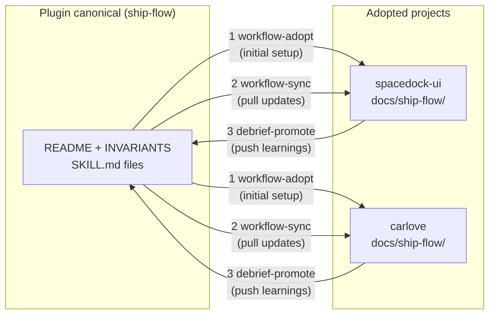

# Ship-Flow — Auditable Autonomous Workflow for Claude 4.7 (v0.5.0)

A scaffolding plugin for captain-directed autonomous work across multi-stage pipelines. This README is written from claude 4.7's perspective — explaining **why** the flow is shaped this way, not how to use each skill (SKILL.md files document the how).

> **Canonical project-level operational doc** (how captain uses ship-flow in THIS project): `docs/ship-flow/README.md`.
> **This file**: plugin-level design rationale. Adopters + onboarding + future-me read this first.

---

## What ship-flow solves

I (claude 4.7) have 1M context + prompt cache. I don't need procedural teaching — I know how to research a codebase, decompose a problem via Musk's 5 steps, apply Shape Up appetite discipline, plan vertical E2E slices, execute atomic commits, verify via goal-backward DC, review my own work. The flow provides none of that teaching. It provides **scaffolding for auditable autonomous work** that I can't reliably produce from context alone:

- **Resumability across sessions** — work pauses (context reset, session end) and resumes cleanly via per-stage `.md` artifacts + entity frontmatter state. Without structured artifacts, resume-after-pause is lossy.
- **Delegation across teammates** — a pitch spans planner (opus) + executer (sonnet) + verifier (opus) named teammates. Named-teammate SendMessage preserves hot context (~10× ramp vs fresh subagent per Phase 2 evidence). The flow codifies who-owns-what per stage.
- **Auditability for other agents + humans** — each stage's `.md` artifact + entity body + cross-review gate verdict = reconstructable decision history. Captain (or another agent) can audit my work without reading code.
- **Canonical doc invariants** — ARCHITECTURE / PRODUCT / README / ROADMAP stay consistent with shipped work via atomic patch-map.sh CAS + named-teammate-dispatched updates at ship-review. Without this, canonical docs silently drift from implementation.
- **Principle enforcement** — CI grep checks (Principle 1-8) catch harness regressions (preamble regrowth, skill count bloat, stale line-anchors, artifact verbosity, etc.) before they decay the flow.
- **Adopter-local guidance enforcement** — ship-flow records non-root app-folder `AGENTS.md` / `CLAUDE.md` files and their project skills from touched files. This deliberately does not duplicate Codex root `AGENTS.md` session behavior; it covers the part Codex does not guarantee across planner, fresh execute workers, and PR-feedback re-entry.

The flow does NOT teach me how to think. It keeps me honest across boundaries where I can't see the whole.

---

## Design principles (opus-4.7-era)

> **Bad news early, no surprises.** Surface blockers, risks, and wrong assumptions to the captain immediately — never let them accumulate to a surprise. This applies across all stages, all teammates, all projects. (Motto codified from `_debriefs/` pattern audit, 2026-04-26.)


### 1. Opus-naturally-does vs load-bearing harness split

The primary design rule (MEMORY 2026-04-23 `opus-4.7-naturally-does-vs-load-bearing-harness`).

**Cut from harness** — what 4.7 does naturally when given a clean directive:
- Musk 5-step decomposition tables (I apply it when told to)
- Appetite sizing tables (I pick `small-batch | medium-batch | big-batch` from scope)
- L0/L1/L2 research procedure (I layer research naturally — codebase first, library if central, web only if unresolved)
- Self-audit questions (I self-audit goal-backward)
- Step-by-step research prompts for fresh subagents (I compose briefs)

**Keep in harness** — what 4.7 gets wrong without enforcement:
- Atomic commits with explicit pathspec (`-a` / `-A` sneaks in contamination under parallel-session load)
- Hash CAS via `patch-map.sh --if-hash` (prevents race with parallel canonical doc edits)
- Canonical sync timing (4 docs at ship-review, not each stage)
- Named-teammate SendMessage over fresh-subagent dispatch (4.7 defaults to fresh without the reminder)
- Grep-based invariant checks (CI catches drift 4.7 would miss in review)

Evidence: the #085 redesign cut stage-skill LOC from 2076 → 912 (-56%) while preserving behavior. The 1164 lines cut were mostly procedural teaching 4.7 does naturally.

### 2. Three-layer skill architecture (Principle 6 Rule B)

Each stage skill composes three layers:

- **Layer A — superpowers atomic skills**: my reasoning primitives. `superpowers:brainstorming` (Q-loop), `superpowers:writing-plans` (plan authoring discipline), `superpowers:writing-skills` (skill design + 4.7 knowledge), `superpowers:subagent-driven-development` (dispatch philosophy), `superpowers:verification-before-completion` (DC-based review).
- **Layer B — ship-flow augmentation**: Shape Up discipline (Musk ≥1 delete, appetite-not-estimate, ≥1 critical assumption, vertical E2E slices), cross-review gates (5-factor rubric), canonical doc sync timing.
- **Layer C — ship-flow canonical primitives**: `lib/extract-section.sh`, `lib/patch-map.sh`, `lib/write-stage-artifact.sh`, `lib/shape-confirm.sh`, `bin/check-invariants.sh`. Atomic + CAS + cross-platform.

Stage skills SHOULD delegate to Layer A for core logic. Exception clause: when Layer A's philosophy conflicts with stage requirement (e.g., ship-shape Mode A autonomous proposer vs brainstorming's Q-loop), stage owns orchestration and documents the exception inline.

### 3. Named-teammate-per-pitch (Principle 6 Rule A)

Default team per active pitch: `planner` (opus) + `executer` (sonnet) + `verifier` (opus). Stage transitions within a pitch use `SendMessage` to the named teammate. Fresh-subagent dispatch reserved for: adversarial review across teammates, clearly separate domain, explicit captain request, or cross-review gate between stages.

Why this matters: opus 4.7 with hot context ramps to work in ~5 min vs ~5K tokens of briefing for a fresh subagent. Over a pitch's lifecycle (5+ stage dispatches), cost differential is $1-2 per pitch; cumulative across projects is meaningful. More importantly, context continuity catches design intent drift that fresh-subagent-per-stage loses.

### 4. Auditable per-stage `.md` artifacts

Each stage writes its output to `<entity-folder>/{stage}.md` via `lib/write-stage-artifact.sh` (Layer C primitive — atomic commit with explicit pathspec, optional CAS via `--if-hash`). An auditor reads across `spec.md / plan.md / execute.md / verify.md / review.md / ship.md` + entity body to reconstruct decision history.

Entity folder layout (default for new pitches in 2.0):

```
docs/<wf>/<id>-<slug>/
  README.md    # entity metadata + stage-artifact links
  spec.md      # ship-shape — problem / appetite / children / DAG / assumptions / deletes / rabbit-holes
  design.md    # ship-design — UI design intent, storyboard frames, design tokens (conditional: affects_ui)
  plan.md      # ship-plan — task breakdown / verification spec / DC
  execute.md   # ship-execute — commits / files modified / UAT evidence
  verify.md    # ship-verify — quality gate / review findings / UAT / verdict
  review.md    # ship-review — PR draft / canonical docs diff citations / token summary
  ship.md      # ship-final — PR link / merge / deploy summary
```

Legacy flat entities (`docs/<wf>/<id>-<slug>.md`) continue to work; no migration required.

---

## The pipeline

```
captain intent (vague / concept / issue)
     │
     ▼
/shape → docs/<wf>/<id>-<slug>/spec.md + ROADMAP.md initial row
     │  (captain gate: confirm / refine / reject)
     ▼
/ship <id> dispatches via SendMessage to named teammates:
     │
     ├── ship-design (designer) → design.md             [conditional: affects_ui]
     │     │                      (cross-review gate)
     ├── ship-plan  (planner) → plan.md                 [cross-review gate]
     │     │
     ├── ship-execute (executer) → execute.md + commits [cross-review gate]
     │     │
     ├── ship-verify (verifier) → verify.md             [cross-review gate]
     │     │
     ├── ship-review (planner) → review.md              [cross-review gate]
     │       + 4-doc canonical dispatch (ARCH/PRODUCT/README/ROADMAP via planner)
     │     │
     └── ship-final → ship.md + gh pr create
           │
           ▼
     captain merge → pitch done, ROADMAP flip to shipped
```

**Captain-in-loop** only at: `/shape` confirm gate, `/verify` BLOCKING findings, PR merge, explicit captain interrupt. All other transitions are autonomous (FO Discipline in INVARIANTS.md).

**Cross-review gate** at every stage transition (Principle 6 Rule C): counterpart teammate (or fresh sonnet fallback; fresh opus when `appetite: big-batch`) evaluates the stage's output on a 6-factor rubric:

| Factor | Question |
|---|---|
| Feasibility | Is the output implementable within the pitch's appetite? |
| Executable scope | Does the work stay within the declared children / artifact boundaries? |
| Quality | Layer B invariants honored (Musk deletes, critical assumption, atomic commits, vertical slices)? Verify-stage critical assumption verified at **live runtime** (dev server up + per-DC command captured), not artifact-only? |
| DC adequacy | Done criteria observable, not "works correctly" prose? |
| Canonical sync | ARCHITECTURE/PRODUCT/README/ROADMAP patches aggregated cleanly with CAS integrity? |
| Reverse-audit | Does the current stage's output expose a gap in the preceding stage's hand-off or coverage? |

**Always Be Coaching (ABC) clause** (Principle 6 Rule C): every VETO or PROMPT_CAPTAIN verdict MUST include a one-sentence coaching note naming which Principle / Failure Mode / INVARIANT the finding enforces, and what past failure or future harm it prevents. NIT-severity findings may omit coaching note.

Verdict: `PROCEED` | `VETO` (feedback-to-upstream, ≤2 rounds) | `PROMPT_CAPTAIN`.

---

## Bidirectional lifecycle

The ship-flow plugin participates in a **bidirectional adoption lifecycle** with the projects that use it.



The cycle: plugin knowledge flows **down** to projects on adoption/sync, and project learnings flow **up** back into the plugin via debrief aggregation.

| Journey | Trigger | Skill | Mechanism |
|---|---|---|---|
| Initial adoption | New project wants ship-flow | `spacedock:workflow-adopt` | Scaffold `docs/<wf>/`, `ARCHITECTURE.md`, `PRODUCT.md`, `ROADMAP.md` |
| Sync updates | Plugin ships new patterns | `spacedock:workflow-sync` | Pull changed SKILL.md / INVARIANTS sections into project |
| Promote learnings | Projects accumulate `_debriefs/` | `spacebridge:debrief-promote` | Aggregate STRONG/WARN patterns → plugin canonical |

**`_debriefs/` convention**: each project accumulates session debriefs under `docs/<wf>/_debriefs/<date>-<seq>.md` (schema: `references/debrief-schema.yaml`). After ≥2 projects have debriefs, run `spacebridge:debrief-promote` to surface cross-project STRONG signals back into plugin docs.

---

## Skill triggers

| Skill | Trigger pattern | Output artifact | Captain in loop? |
|---|---|---|---|
| `/shape "<directive>"` | vague / concept / issue / todo-tid / entity-id | `spec.md` (+ ROADMAP.md row) | ✅ confirm / refine / reject |
| `/shape --discuss "<text>"` | captain opts into Mode B | same, delegates Q-loop to `superpowers:brainstorming` | ✅ via brainstorming Q-loop |
| `/shape "<skill-auth>"` | keywords `create/build/write/improve a skill` / `SKILL.md` / path `*/skills/*` | same, delegates design to `superpowers:writing-skills` (Mode C auto-detect) | ✅ |
| `/ship <entity-id>` | sharp entity ready | per-stage `.md` + code commits + PR | ❌ (FO Discipline) |
| `/ship "<requirement>"` | free text | routes to `/shape` if vague | ✅ (if routed) |
| `/ship-design <entity-id>` | pipeline-dispatched when `affects_ui: true` (or `--force`) | `design.md` + `plugins/<app>/design/*` artifact bundle | conditional — captain smoke on UI |
| `/verify <entity-id>` | pipeline-dispatched OR standalone | `verify.md` | conditional — BLOCKING findings only |
| `/verify --fast` | captain manual fast-feedback | same, skips cross-review gate | ❌ |
| `/verify --full` | force full re-run UAT | same, fuller evidence | ❌ |
| `/add-todos "<text>"` | rabbit hole / unexpected finding capture | todo entry in `docs/<wf>/todos/<slug>.md` | ❌ |

**Escape hatches** built into /shape:
- Directive `<80 chars` + contains `fix|typo|rename|bump|patch|bugfix|hotfix` as whole word → announce "shape unnecessary, run /ship directly" and exit.
- Directive specifies concrete file paths / reproducible bug / typed acceptance → suggest `/ship <requirement>` path.

---

## Use cases

**Big feature (multi-child pitch)**:
```
captain: /shape "add comment threading to War Room"
me (Mode A): L0 research → 3 children vertical slices → pitch
captain: confirm
me: dispatch /ship <child-1>, /ship <child-2>, /ship <child-3> autonomously
```

**Bug fix (escape-hatch)**:
```
captain: /shape "fix null ptr in auth middleware src/auth/middleware.ts:47"
me: escape-hatch trigger — "shape unnecessary, run /ship <entity-id> after creating sharp entity"
(captain creates entity manually or via /add-todos → /ship <tid>)
```

**Skill authoring (Mode C auto-detect)**:
```
captain: /shape "create a skill that audits yaml files for security patterns"
me (Mode C auto): delegate design to superpowers:writing-skills, wrap with Shape Up (appetite = small-batch, 1 child, ≥1 critical assumption about yaml-parse library)
```

**Standalone verify (fast-feedback)**:
```
captain: /verify 078 --fast
me: scoped gate (surfaces execute touched) + spot-check ≤2 critical DCs, skip cross-review → verify.md
captain reviews → directs next action
```

**Todo promotion**:
```
(earlier) /add-todos "filter-chip-multi on dashboard feels sluggish"
(later) captain: /shape filter-chip-multi
me: read todo body as directive → Mode A pitch → children
```

---

## Named-teammate pattern

**Spawn at /shape confirm** (TeamCreate + Agent spawn):
```bash
# captain-side (or ship-shape on confirm):
TeamCreate(team_name: "pitch-<id>", agent_type: "planner")
Agent(name: "planner", team_name: "pitch-<id>", model: "opus", ...)
Agent(name: "executer", team_name: "pitch-<id>", model: "sonnet", ...)
Agent(name: "verifier", team_name: "pitch-<id>", model: "opus", ...)
```

**Reuse across stages via SendMessage** (no re-spawn, no fresh context):
```bash
# /ship dispatches plan stage:
SendMessage(to: "planner", message: "...plan brief...")
# planner continues from same context — hot ramp ~5 min

# /ship dispatches execute stage:
SendMessage(to: "executer", message: "...execute brief with plan.md link...")

# /ship dispatches verify stage:
SendMessage(to: "verifier", message: "...verify brief with execute.md...")
```

**Fresh-subagent dispatch** only when:
(a) adversarial review crossing teammate roles;
(b) clearly separate domain from pitch context;
(c) explicit captain request;
(d) cross-review gate counterpart (structured 5-factor prompt).

**Cross-review reviewer fallback** (Q1-answer codified):
- `sonnet` default.
- `opus` when `appetite: big-batch` — rigor scales with scope.

**Circuit breaker**: VETO loop max 2 rounds per stage → round 3 escalates PROMPT_CAPTAIN.

---

## For adopters

**Commissioning to a new repo**: use `/spacedock:commission` with `ship-flow` as template plugin. The commissioner scaffolds `docs/<wf>/README.md` with `entry-point:` frontmatter + creates initial `ARCHITECTURE.md`, `PRODUCT.md`, `ROADMAP.md` with section tags for `patch-map.sh`.

**Debrief convention**: after each shipped pitch, run `spacedock:debrief` to write a session debrief under `docs/<wf>/_debriefs/<date>-<seq>.md`. Debriefs follow the schema in `references/debrief-schema.yaml` (required sections: `## Shipped`, `## Filed (backlog)`, `## Issues — Workflow`, `## Issues — Spacedock`, `## Non-PR commits (workflow-only)`, `## Observations`, `## Decisions`, `## What's Next`). The `spacebridge:debrief-promote` skill aggregates cross-project debrief patterns and promotes STRONG signals back into plugin canonical docs.

**Canonical docs section-tagging contract** (required for Layer C primitive compatibility):
```markdown
<!-- section:<tag> -->
## <Heading>
...content...
<!-- /section:<tag> -->
```
Tags declared in `references/flow-map-schema.yaml`. `lib/extract-map.sh` + `lib/patch-map.sh` operate on these atomically with `--if-hash` CAS.

**Layer C primitive inventory** (by responsibility):
| Primitive | Role |
|---|---|
| `lib/shape-confirm.sh` | entity folder initializer — writes spec.md + README.md + ROADMAP row atomically |
| `lib/write-stage-artifact.sh` | per-stage `{stage}.md` writer — wraps content in `<!-- section:<stage>-report -->` + atomic commit |
| `lib/write-section.sh` | section-tag writer — upserts a named section in an entity file (Principle 5a complement to extract) |
| `lib/extract-section.sh` | section-tag reader — preferred over direct `Read` on entity files (Principle 5a) |
| `lib/extract-map.sh` | canonical doc section reader (ARCHITECTURE/PRODUCT/ROADMAP) |
| `lib/patch-map.sh` | canonical doc section writer — atomic + `--if-hash` CAS + mermaid whitelist |
| `lib/map-helpers.sh` | shared utilities for map-layer primitives (cross-platform sha256, awk body-from-FILE pattern) |
| `lib/register-stage-output.sh` | appends stage output reference to entity body `stage_outputs[]` (required for render-stage-links compatibility) |
| `lib/render-stage-links.sh` | rebuilds entity body from `stage_outputs[]` — used by advance-stage; destructive on legacy entities without backfilled stage_outputs |
| `lib/advance-stage.sh` | advances entity status field atomically; triggers render-stage-links rebuild |
| `lib/update-entity-status.sh` | raw status field updater (lower-level; prefer advance-stage for pipeline transitions) |
| `lib/verify-assumption.sh` | asserts a critical assumption by running a shell command and logging result to entity |
| `lib/density-classify.sh` | classifies entity density (4-tier: low/medium/high/critical) — used by cross-review verdict-flip whitelist (Principle 6 Rule C) |
| `bin/check-invariants.sh` | CI grep enforcement of Principles 1-8 + stage-artifact-path / layer-a-delegation / cross-review-gate / structural-parity-dc / ask-fallback-coverage / indirection-sweep-emitted checks |

**Skill count policy** (Principle 2 split): stage skills ≤ 7 cap, utility skills uncapped. Current inventory: 7 stage (`ship-shape`, `ship`, `ship-design`, `ship-plan`, `ship-execute`, `ship-verify`, `ship-review`) + 3 utility (`add-todos`, `ship-onboard`, `ship-runtime-detect`). At cap (7/7). Enforced by `check-invariants.sh --check skill-count`.

**FO Discipline** (when to pause for captain): documented in `INVARIANTS.md § FO Discipline`. Short version: only `/shape` confirm, verify BLOCKING findings, PR merge, and explicit captain interrupt are captain-gates. All other transitions autonomous.

---

## Further reading

- **`INVARIANTS.md`** — Principles 1-8 (hard grep-enforced + captain-gate checklist). Start here to understand WHY each rule exists.
- **`references/entity-body-schema.yaml`** — structured section schema per stage. Source of truth for what sections each `{stage}.md` must contain.
- **`references/flow-map-schema.yaml`** — canonical doc section-tag declarations.
- **`docs/ship-flow/ship-shape-v2-implementation.md`** — #085 entity: full 6-wave redesign journal with rationale, decisions, and evidence. The case study for this flow's design.
- **Individual SKILL.md files** under `skills/*/` — procedural detail per skill. Written concisely (opus-naturally-does applies).

---

## Release Notes

### 0.5.0 — 2026-04-24

**Theme**: Ship-flow 2.0 — formalized captain-in-loop autonomous pipeline for Claude 4.7.

**For adopters upgrading from 0.4.0**:

- Three skill entry points replace the single-entry 1.x model:
  - `/shape "<directive>"` — framing gate; captain reviews once, then autonomy takes over.
  - `/ship <entity-id|requirement>` — dispatches plan → execute → verify → review → ship-final.
  - `/verify <entity-id>` — standalone fast-feedback outside the pipeline loop.
- Per-stage `.md` artifacts land in the entity folder (`docs/<wf>/<id>-<slug>/{spec,plan,execute,verify,review,ship}.md`). Work is resumable after session reset; audit trails self-contain. Legacy flat entities (`docs/<wf>/<id>-<slug>.md`) remain supported.
- Cross-review gate at every stage transition (5-factor rubric: feasibility / executable scope / quality / DC adequacy / canonical sync). Verdict `PROCEED | VETO | PROMPT_CAPTAIN`; VETO loops capped at 2 rounds before escalation.
- Named-teammate pattern per pitch (Principle 6 Rule A): `planner` (opus) + `executer` (sonnet) + `verifier` (opus/sonnet). Stage transitions use `SendMessage` — ~10× faster than fresh-subagent dispatch via hot-context reuse.
- Seven principles codified in `INVARIANTS.md` with `bin/check-invariants.sh` grep enforcement — catches harness regressions (preamble regrowth, skill-count bloat, stale line-anchors, Layer A delegation drift, cross-review gate absence, structural-parity DC gaps) at CI-time. (Extended to 8 principles post-0.5.0.)
- Three-layer skill architecture (Layer A superpowers atomic / Layer B ship-flow augmentation / Layer C canonical primitives) enables dogfood portability across projects.

**Layer C primitives introduced**:

- `lib/write-stage-artifact.sh` — per-stage `.md` atomic writer with explicit pathspec.
- `lib/shape-confirm.sh --layout=folder` — entity folder initializer (`README.md` + `spec.md` skeleton).
- `bin/check-invariants.sh` — Principle 2 split counting (stage ≤ 7 / utility uncapped) + 4 checks at launch (stage-artifact-path, layer-a-delegation, cross-review-gate, structural-parity-dc); extended post-0.5.0 with ask-fallback-coverage, indirection-sweep-emitted.

**Breaking**:

- `ship-sharp` alias removed. `ship-shape` is canonical — update any captain muscle-memory or docs referencing `/ship-sharp`.

**Unchanged**:

- Escape hatches in `/shape` (directive <80 chars + `fix|bump|typo|rename|patch|bugfix|hotfix` keyword → route to `/ship`).
- Commission flow: `/spacedock:commission` with `ship-flow` template still scaffolds `docs/<wf>/README.md` + initial canonical docs.
- Layer C primitives `extract-section.sh` / `extract-map.sh` / `patch-map.sh` remain the atomic + CAS + cross-platform interface.

**Upgrade path**: no migration required. Existing flat-layout entities continue to work; new entities from `/shape` default to folder layout.

**Design context**: design rationale lives in the sections above (opus-4.7-naturally-does vs load-bearing harness split, 3-layer skill architecture, principle enforcement). Full 6-wave implementation record at `docs/ship-flow/ship-shape-v2-implementation.md` (entity #085, merge `d8934761`).

---

### Post-0.5.0 hardening (pitch-106 + pitch-107)

Incremental additions after the 0.5.0 release that are not yet a named version but are fully shipped on main:

**Workflow SOT sync**:
- `docs/ship-flow/README.md` is the dogfood workflow SOT. Run `bash plugins/ship-flow/lib/sync-workflow-sot.sh --check` in CI or before review to detect drift, and `bash plugins/ship-flow/lib/sync-workflow-sot.sh --write` after changing the SOT to refresh derived files (`workflow-template.yaml` and this README's managed design-stage summary).

**`design` stage added** (pitch-104):
- New stage `design` inserted between `shape` and `plan`. Always runs (no `skip-when:` clause); trivial-pass fast-path in Phase 0 short-circuits pure mechanical work (no `affects_ui`, no matched domain, no `design_required`, no `contract_decision_required`, no `open_contract_decisions`). Dispatched by `/ship` to `designer` teammate (opus). Output: `design.md` + narrow artifact bundle required by the selected `design-dispatch-manifest`. Per pitch 116 W3 (design always runs); INVARIANTS Principle 11 "Design Stage Required".
- Stage skill `ship-design` added — 7th and final stage skill (at the ≤7 cap). Category A-D are active: A runs the full design system chain; B handles component breakout; C handles component variation; D handles one-off visual work. Delegates to `storyboard`, `design-flow`, `frontend-design`, and `design-review`; fallback to `superpowers:brainstorming` when design plugins absent. Registered domain lanes route through `domain-designer` and the domain registry specialist.

**Principle 6 Rule C extensions** (pitch-106):
- Cross-review rubric extended from 5-factor to 6-factor: `Reverse-audit` added as base 6th factor — each stage's cross-review must check whether its output exposes a gap in the preceding stage's hand-off.
- `Render Fidelity` available as optional 7th factor for UI entities (`affects_ui: true` + `render_fidelity_status` present).
- Always Be Coaching (ABC) clause codified: every VETO / PROMPT_CAPTAIN verdict must include a one-sentence coaching note naming the Principle and the harm it prevents.
- FO Ask-Fallback pattern: when a stage agent's Boot Self-Check detects missing context it cannot resolve autonomously, it MUST escalate via `SendMessage(FO)` with a structured prompt — never guess or silently proceed. Enforced by `check-invariants.sh --check ask-fallback-coverage`.

**Principle 5d — indirection sweep** (pitch-106):
- When `ship-runtime-detect` Step R5 yields `theme_indirection: tailwind-v4`, `ship-plan` auto-emits a Wave 0 indirection audit task. Plan cross-review blocks if this task is absent. Enforced by `check-invariants.sh --check indirection-sweep-emitted`.

**Principle 4 extension — `pre-acked-stubs`** (pitch-106):
- `pre-acked-stubs: true|false` in entity frontmatter is a Principle 4 boolean gate. When `true`, ship-plan Step 4 auto-clears all stub flags. When `false` (default), each stub task requires an explicit Stub Flag entry in the Plan Report with captain rationale before cross-review PROCEED.

**Principle 8 — Artifact verbosity discipline** (pitch-107):
- New principle (8th) codified from pitch-107 dogfood. Stage `.md` files must budget body content: plan.md ≤200 lines, execute.md ≤150, verify.md ≤120, review.md ≤100, ship.md ≤60. Verbose evidence goes inside `<details>` blocks; main body holds TL;DR + structured findings table only.
- `check-invariants.sh --check artifact-verbosity` is proposed but not yet wired as of pitch-107 ship.

---

## Revision

- **2026-04-28** — Post-0.5.0 hardening updates: design stage, Principle 8, pitch-106/107 capability additions (see §Post-0.5.0 hardening above).
- **2026-04-24** — 0.5.0 plugin release (see §Release Notes above).
- **2026-04-23** — Ship-flow 2.0 landed via pitch #085 (merge commit `d8934761`). This README authored post-ship as the canonical plugin-level design doc.

---

*This flow is optimized for claude 4.7 autonomous execution with captain oversight. It may be over-engineered for 4.5-era agents and under-scaffolded for models without 1M context / prompt cache. Adapt the harness-diet principle per your model's strengths.*
