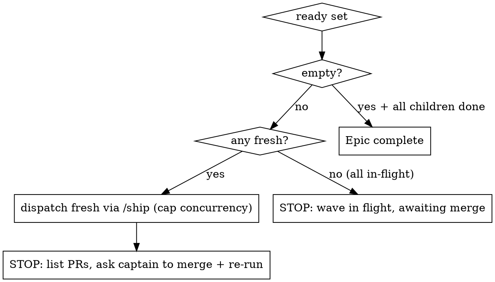

# ship-epic — depends-on-aware wave orchestrator

## Overview

You run an epic's born-sharped children through the existing `/ship` pipeline **in dependency order**. The spacedock FO dispatch (`status --next`) is **depends-on blind** — it would dispatch every child at once, ignoring `depends-on`. This skill adds the missing gate: each child runs only after every child it `depends-on` is `done`. Within a wave, independent children run in parallel (capped by the workflow concurrency).

`/ship-project` STOPS at entities+plan. THIS skill is what the clean session invokes to actually run them. Merge is captain-gated, so the orchestrator runs one **wave** at a time and **stops at the wave boundary** for the captain to merge before the next wave.

## When to use

- A pitch/epic exists with `pattern: pitch`/`status: epic` and `parent_pitch` children carrying `depends-on` (e.g. instantiated by `/ship-project`).
- You want the children shipped without hand-feeding `/ship <child>` one at a time.
- NOT for a single standalone entity — use `/ship <id>` directly.

## The wave loop

Resolve `WORKFLOW_DIR` from `docs/*/README.md` `entry-point:`. Then:

1. **Plan** — `bash plugins/ship-flow/lib/dag-waves.sh --layers --from-workflow <WORKFLOW_DIR> --epic <epic-id>` → print the wave layers (situational awareness; this is the static parallel plan).
2. **Ready set** — `bash plugins/ship-flow/lib/dag-waves.sh --ready --from-workflow <WORKFLOW_DIR> --epic <epic-id>` → children whose `depends-on` are all `done` and that are not themselves `done`.
3. **Classify** each ready child by reading its `index.md` frontmatter — **status first**. A born-sharped child's entry stage is `design` or `plan`; the `verify` and `ship` stages run `worktree: false` (README `stages`), so a missing `worktree` does NOT mean a child is fresh — it may be an advanced child mid-pipeline.
   - **fresh** — `status` is `design` or `plan` (entry stages) AND `worktree` empty AND `pr` empty. Not yet started → dispatch.
   - **in-flight** — everything else in the ready set: `status` is `execute`/`verify`/`ship` (already advanced — a missing worktree at `verify`/`ship` is expected, not a fresh signal), OR `worktree` set, OR `pr` set. Already running or PR open → do NOT dispatch.
4. **Dispatch the fresh children** — for each, invoke `/ship <child-id>` (the existing single-entity pipeline; it runs design/plan/execute/verify/review to a PR). Run at most `min(fresh count, workflow concurrency)` concurrently (concurrency = `stages.defaults.concurrency` in the workflow README, default 2). `/ship` is resumable, so a re-dispatched in-flight child is never restarted — that is why step 3 excludes them.
5. **Wave barrier** — once this wave's children reach PR-ready, STOP. Surface to the captain: the wave's PR list + the literal next step: *"Review + merge these PRs, then re-run `/ship-flow:ship-epic <epic-id>` to launch the next wave."* Do NOT start the next wave in this session — dependent children need the merged code on the base branch, and merge is captain-gated.

6. **Resume** — re-invoking recomputes from current statuses: merged children are now `done`, so `--ready` returns the next wave. Loop until `--ready` is empty and all children are `done` → **"Epic complete: N children shipped."** The skill is stateless; the entity statuses are the only state.

## --plan (dry-run)

`/ship-flow:ship-epic <epic-id> --plan` prints the wave layers, the current ready set, and the fresh/in-flight/done classification — and the children it WOULD dispatch this wave — without invoking `/ship`. Use to preview before committing, or to inspect a stuck epic.

## Quick reference

| Need | Command |
|---|---|
| wave layers (static plan) | `dag-waves.sh --layers --from-workflow <wf> --epic <id>` |
| ready set (deps satisfied, not done) | `dag-waves.sh --ready --from-workflow <wf> --epic <id>` |
| dispatch one child | `/ship <child-id>` |
| concurrency cap | `stages.defaults.concurrency` in `<wf>/README.md` (default 2) |

`dag-waves.sh` exits 2 on a `depends-on` cycle and 3 on an unknown `depends-on` reference — surface either to the captain; do not dispatch a structurally broken epic.

## Common mistakes

| Mistake | Reality |
|---|---|
| Reading `spacedock status --next` to pick children | `status --next` is depends-on **blind** — it returns dependent children too. ALWAYS gate with `dag-waves.sh --ready`. |
| Dispatching the next wave in the same session | Dependent children need the prior wave **merged** to the base branch. Stop at the wave boundary; the captain merges. |
| Re-dispatching an in-flight child | Classify by **status first**, not worktree/pr alone. `verify`/`ship` are `worktree: false`, so an advanced child with no worktree (and pr not yet written) looks "fresh" by the naive test — only `design`/`plan` with no worktree/pr is fresh. Dispatching an `execute`/`verify`/`ship` child restarts in-flight work. |
| Treating the epic parent as a buildable entity | The epic (`status: epic`) is a container — never `/ship <epic-id>`. Dispatch its children. |
| Stopping when `--ready` is non-empty but all in-flight | That is the merge barrier, not completion — surface "awaiting merge", do not declare the epic done. |
