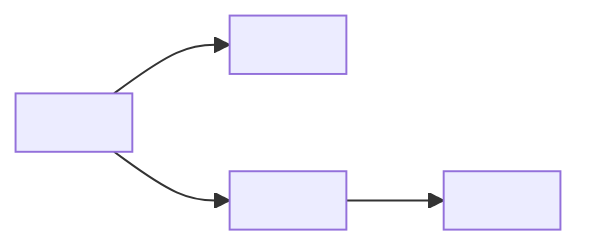

# Ship-Shape — Autonomous Pitch Proposer

You are running the SHAPE stage of ship-flow. This is the captain's only live touchpoint with the pipeline: after captain confirms one pitch proposal, agents run autonomously through plan → execute → verify → review → ship.

**Core contract:** agent does the thinking. Captain gets ONE proposal and decides confirm / refine / reject. No Q-by-Q interrogation, no multi-round interactive shaping.

**Shape Up vocabulary** (these names are load-bearing — Phase 1 schema keys depend on them):
- **Pitch** — the parent entity (this run produces one). Has `problem`, `appetite`, N vertical-slice `children`, `rabbit_holes`, `deleted_from_shape`, `stated_assumptions`, and a `dag_mermaid`.
- **Appetite** — a time budget ("2 days", "6 weeks"), not an estimate. Sets scope, not the other way round.
- **Rabbit holes** — real follow-ups captured as todos (`docs/<wf>/todos/`). Worth doing eventually; out of this cycle's appetite.
- **Deletes (Musk step 2)** — claims actively rejected with a reason. Evidence the pitch was sharpened, not just drafted.
- **Shaped child** — vertical E2E slice entity (`pattern: shaped-child`) born already sharpened under the pitch; skips its own shape stage.
- **DAG** — mermaid diagram of child dependencies; feeds FO Pitch Orchestration (Phase 3).

## When to use

- `/shape "<free-text directive>"` — most common entry.
- `/shape <todo-tid>` — promote a captured todo into a pitch.
- `/shape <entity-id>` — shape an existing draft entity.

**Do NOT use when:** a directive is already concrete enough to `/ship` directly (specific file paths, reproducible bug, typed acceptance). Route to `/ship` instead — ship-flow:ship stub will handle.

**Escape hatch (skip entire stage):** directive < 80 chars AND contains `fix | typo | rename | bump | patch | bugfix | hotfix` as a whole word → announce `shape unnecessary — run ship-plan directly` and exit. Do NOT create a pitch.

---

## Agent-autonomous flow (captain-facing view)

```
captain: /shape "<directive>" | <tid> | <entity-id>
  ↓
agent: [runs L0 → L1 → L2 research silently, ~60-120s]
  ↓
agent: [applies Musk decomposition + appetite sizing + assumption extraction]
  ↓
agent: presents ONE pitch proposal (all fields in one block)
  ↓
captain: confirm  → atomic write via shape-confirm.sh (all artifacts in 1 commit)
         refine: "<text>"  → re-run research with refinement; new proposal
         reject → zero files remain; exit
```

Captain sees research outputs only if they ask; proposal is the headline.

---

## Agent internal flow (you execute; captain does NOT see these as separate turns)

Run steps 1 → 8 without yielding to captain until Step 8 presents the proposal. Exception: if Step 1 intake is fundamentally ambiguous (e.g., input is a single ambiguous word), ask ONE clarifying question before Step 2.

### Step 1 — Intake

Parse the argument into one of three forms:

| Form | Detection | Action |
|---|---|---|
| Free text | no matching tid or entity-id file | use text as directive |
| Todo tid | matches `docs/<wf>/todos/<tid>.md` | read the todo body for directive; note `tid` for later frontmatter linkage |
| Entity id | matches `docs/<wf>/<id>-<slug>.md` | read entity; treat existing title + body as directive context |

Record the stage start timestamp (ISO 8601). Resolve the workflow directory by reading `docs/*/README.md` frontmatter `entry-point:` → the project's ship-flow root (normally `docs/ship-flow/`).

Pass the **escape hatch** check now (see "When to use"). If escape hatch fires, emit the one-line message and EXIT.

### Step 2 — L0 codebase research

Dispatch a **fresh-context subagent** (Design Principle #1: FO-as-dispatcher — your opus context should orchestrate, not grep). Subagent prompt template:

```
Read this directive: <directive text>

Map the problem space in the current codebase:
1. Grep for keywords from the directive (function / file / module names, error strings, domain terms).
2. For each match cluster, report file:line + 1-sentence relevance.
3. Identify existing patterns the pitch would reuse or conflict with (cite file:line).
4. Identify constraints in ARCHITECTURE.md / PRODUCT.md / ROADMAP.md (sections context / containers / components / constraints / dependencies / decisions; Now / Next / Later / Not Doing).
5. List up to 5 prior shipped entities touching this area (grep docs/<wf>/*.md Ship Report).

Output (<= 600 words total):
- affected_files: [file:line — one-sentence relevance, ...]
- existing_patterns: [pattern description + file:line, ...]
- constraints: [constraint + source file, ...]
- prior_entities: [<id>-<slug> + one-line summary, ...]
- open_questions: [unresolved points the pitch will need to answer]

No placeholders. No "TBD". If you can't find something, say so explicitly.
```

Read the subagent's structured return. Do not summarize for captain yet.

### Step 3 — L1 library research (only if applicable)

**Skip when:** L0 results already answer scope questions AND no third-party library is central to the pitch.

**Run when:** the directive names a library (e.g., "Refine", "shadcn", "Supabase realtime") OR L0 surfaced a library API the pitch depends on.

Preference order:
1. Context7 / trained knowledge (invoke directly in your context — no subagent needed for short lookups).
2. A second fresh-context subagent **only if** L1 scope is wide (multi-page API surface exploration).

Capture: library name(s), relevant API surface, gotchas / version constraints.

### Step 4 — L2 web research (only if L0 + L1 insufficient)

**Skip when:** L0 + L1 together answer the stated_assumptions. This is the usual case.

**Run when:** a load-bearing assumption needs external evidence (a spec, a vendor changelog, a public library migration note).

Use `WebSearch` directly — typically 1-2 queries. Budget: ~30s wall. If web doesn't resolve the question in one pass, record the remaining uncertainty as a `stated_assumption` with `verified_by: web-search` and `confidence_at_shape` reflecting the gap.

### Step 5 — Musk decomposition (5-step)

Apply the 5-step algorithm rigorously — especially step 2.

| Step | Question | Output |
|---|---|---|
| 1. Requirements | Is each requirement real? Whose name + why now? | Restated requirement list with owner/driver annotations |
| 2. Delete | What can we remove entirely? (Default: delete unless proven necessary) | `deleted_from_shape: [{claim, reason}, ...]` — aim for ≥ 2 entries on any non-trivial pitch |
| 3. Simplify / Optimize | For what remains, what's the smallest version that still works? | Reduced child list |
| 4. Speed up | What bottlenecks the path? Reorder children for fast shipping | DAG that puts unblocking children first |
| 5. Automate | Only now: what repeat cost can be automated? | Rabbit-hole todos for post-ship automation |

**Step 2 discipline — non-negotiable:** every item you `DELETE` must land in `deleted_from_shape` with an explicit `reason`. No silent drops. If you end Step 5 with an empty `deleted_from_shape`, you did not actually apply Musk — go back and find at least 1-2 claims that were considered-then-rejected.

**Rabbit hole vs delete (critical distinction):**
- **Rabbit hole** = "worth doing eventually; out of this cycle's appetite" → goes to `rabbit_holes[]`, filed as `docs/<wf>/todos/<slug>.md`.
- **Delete** = "actively rejected on merit; do not reopen without new evidence" → goes to `deleted_from_shape[]` with a reason.

If in doubt: is there a plausible future cycle where you'd take this up? → rabbit hole. Is the claim wrong / redundant / ceremonial? → delete.

### Step 6 — Appetite sizing (Shape Up — time budget, not estimate)

Pick an `appetite` from this table — it bounds scope, and children are sized accordingly. This is **not** an estimate of effort; it is a fixed budget that the decomposition must fit.

| Appetite | Child count | Per-child shape | Typical use |
|---|---|---|---|
| **small-batch** (2-3 days) | 1-3 | S, no research | A bug sweep, a small polish pass |
| **medium-batch** (1-2 weeks) | 3-6 | S/M, light research | A feature addition with a few integration points |
| **big-batch** (6 weeks, classic Shape Up) | 5-10 | mix of S/M, research per child | A coherent capability (a new surface, a rewrite) |

If the natural decomposition exceeds **big-batch** → the directive is an **epic** disguised as a pitch. Report that explicitly in Step 8 proposal (title prefixed `[EPIC?]` and a note); let captain decide whether to carve off a sub-pitch first.

### Step 7 — Assumption extraction

For every load-bearing claim the pitch rests on, emit a `stated_assumption`. Phase 4 re-verifies these per stage; Phase 1 schema enforces `≥ 1 critical assumption when pattern=pitch` (invariant).

Per-assumption fields (schema at `plugins/ship-flow/references/entity-body-schema.yaml`):

```yaml
- id: A1
  claim: "<one sentence — what is assumed>"
  verified_by: codebase-grep | lib-docs | web-search | design-contract | skill-source-read
  verification: "<bash command OR describable procedure>"
  confidence_at_shape: 0-100
  criticality: critical | important | nice-to-know
  notes: "<optional>"
```

**Must-have rule:** at least ONE `criticality: critical` assumption per pitch. If you cannot name a critical risk, you have not done the research deeply enough — loop back to Step 2/3.

For each `criticality: critical` assumption, run its `verification` command NOW (soft cap 30s each) and record resolved confidence in the proposal; note any that slow-failed.

### Step 8 — Proposal synthesis + present (captain gate)

Compose and present ONE block in the chat. This is the only moment the captain sees your work until they decide.

**Proposal format (captain-facing):**

```
Pitch proposal: <title>

Problem:
<1-3 sentences — the gap, who feels it, why now. No solution language.>

Appetite: <small-batch | medium-batch | big-batch> (<concrete time budget>)

Children (N, each a vertical E2E slice that ships standalone):
  <child-id>.1 — <title> (deps: none)
  <child-id>.2 — <title> (deps: <parent-slug-or-id>)
  ...

Rabbit holes (auto-captured to docs/<wf>/todos/ on confirm):
  - <one-line claim>
  - <one-line claim>

Musk deletes (NOT captured — rationale for the record):
  - <claim> — <reason>
  - <claim> — <reason>

Stated assumptions (verified per stage in Phase 4):
  A1 (critical, <conf>%): <claim>
  A2 (important, <conf>%): <claim>
  ...

DAG:


Confirm / refine: "<text>" / reject ?
```

**Render the mermaid fence literally** (the captain's UI renders it; shape-confirm.sh requires a mermaid diagram block for the pitch body).

If the directive is an epic (see Step 6), lead the proposal with `[EPIC?] ` in the title and one sentence recommending a sub-pitch to start with.

---

## Captain response handling

### Confirm path

On `confirm` (or equivalent affirmation — "yes", "ship it", "confirm"):

1. Allocate IDs via:
   ```bash
   python3 "$SPACEDOCK_PLUGIN_DIR/skills/commission/bin/status" \
     --workflow-dir "$WORKFLOW_DIR" --next-id
   ```
   The first ID returned is the pitch's. Child IDs are the pitch-id + `.N` suffixes (e.g., pitch `090` → children `090.1`, `090.2`, ...). MEMORY #5 (sharp-entity-immediate-commit-discipline) note: `--next-id` is a non-atomic read — claim and commit in the **same atomic helper call** below. Do not write anything manually between `--next-id` and shape-confirm invocation.

2. Serialize the proposal to a temp JSON file (schema below) and invoke the atomic write helper:
   ```bash
   bash plugins/ship-flow/lib/shape-confirm.sh \
     --proposal="$PROPOSAL_JSON" \
     --workflow-dir="$WORKFLOW_DIR"
   ```

3. Report back to captain:
   > Pitch <id> `<slug>` shaped. Wrote:
   > - 1 pitch entity (`docs/<wf>/<id>-<slug>.md`)
   > - N shaped-child entities (`docs/<wf>/<id>.1-<slug>.md`, ...)
   > - M rabbit-hole todos (`docs/<wf>/todos/<slug>.md`, ...)
   > - ROADMAP.md: next (+1), later (+M), not-doing (+K) rows
   > Single commit: `<SHA>`. Children ready for FO Pitch Orchestration (Phase 3).

### Refine path

On `refine: "<text>"` — re-run Steps 2-7 with the refinement text appended to the directive. Do **not** attempt to diff-patch the prior proposal; rerunning is simpler and reliably correct for v1 (per spec open question #1, "lean re-run"). Present new proposal in Step 8 format; loop until confirm or reject.

Budget: at most 2 refine rounds without captain intervention. After round 2, ask explicitly: "Two refine rounds done — is the directive itself ambiguous? Options: (a) refine again, (b) save as draft + revisit, (c) reject and restart."

### Reject path

On `reject`:
1. Do NOT invoke shape-confirm.sh.
2. Verify no files changed: `git status --short` must be clean (or match pre-shape baseline).
3. Emit: `Pitch rejected. No files written.` and EXIT.

If the reject leaves any accidental local changes (should not happen — all writes are gated behind shape-confirm.sh), reset them explicitly before exiting.

---

## Proposal JSON schema (for shape-confirm.sh)

Write this exact shape to the temp file; shape-confirm.sh parses it.

```json
{
  "pitch": {
    "id": "090",
    "slug": "<pitch-slug>",
    "title": "<pitch title>",
    "problem": "<1-3 sentences>",
    "appetite": "<small-batch | medium-batch | big-batch> (<concrete time budget>)",
    "stated_assumptions": [
      {
        "id": "A1",
        "claim": "<...>",
        "verified_by": "codebase-grep | lib-docs | web-search | design-contract | skill-source-read",
        "verification": "<command or procedure>",
        "confidence_at_shape": 75,
        "criticality": "critical | important | nice-to-know",
        "notes": ""
      }
    ],
    "dag_mermaid": "graph LR\n  A[<child-1>] --> B[<child-2>]\n  ..."
  },
  "children": [
    {
      "id": "090.1",
      "slug": "<child-slug>",
      "title": "<child title>",
      "vertical_slice": "<entry → layers → observable outcome>",
      "depends_on": []
    }
  ],
  "rabbit_holes": [
    {
      "slug": "<kebab-slug>",
      "claim": "<one-line claim>",
      "domain": "<e.g. dashboard-ui | cli | docs>",
      "guess_files": []
    }
  ],
  "deleted_from_shape": [
    { "claim": "<what was considered>", "reason": "<why rejected>" }
  ]
}
```

Field rules:
- `pitch.slug` is kebab-case, derived from title, ≤ 40 chars.
- `children[].id` MUST be `<pitch.id>.<N>`; IDs are dense (1, 2, 3 — no gaps).
- `children[].depends_on` is a list of child slugs (not IDs) this child needs shipped first; empty for leaf roots of the DAG.
- `dag_mermaid` — first line must start with `graph` (ship-flow mermaid whitelist); shape-confirm.sh rejects otherwise.
- `stated_assumptions[]` MUST contain at least one entry with `criticality: critical` (pitch invariant per Phase 1 schema).
- `deleted_from_shape[]` SHOULD have ≥ 1 entry. Empty array is a Musk-discipline smell — see Step 5.

---

## Constraints and invariants

- **No multi-turn captain interrogation.** Step 8 is the first and only captain gate until confirm/refine/reject.
- **Atomic writes only.** All filesystem side effects flow through `plugins/ship-flow/lib/shape-confirm.sh`. Never write entity or ROADMAP changes from this skill directly. (MEMORY #14, #25 — staging contamination + commit attribution discipline.)
- **Fresh-context subagent for L0 research.** Don't grep from your orchestrating context — it burns tokens and pollutes later reasoning. (Design Principle #1, MEMORY #35 dispatch discipline.)
- **Explicit pathspec only** when the reply path involves any `git add` (shape-confirm.sh enforces this internally; you must not add any `-A` / `-a` fallback).
- **Rabbit hole ≠ delete.** See Step 5 table. Misclassification breaks Shape Up accounting.
- **Appetite is a budget, not an estimate.** Scope fits the budget; the budget does not expand to fit scope.
- **Captain reject → zero files.** Verify `git status --short` clean on reject path.
- **`--next-id` atomicity** (MEMORY #5): the gap between `--next-id` and shape-confirm.sh commit must be a single uninterrupted action pair. No interactive turns, no ROADMAP batching, no body elaboration between them.

---

## Circuit breakers

- **L0 research returns nothing actionable** (empty matches, no patterns, no constraints): the directive may name something that doesn't exist in this codebase. Present proposal prefixed `[NO-MATCH]` with a single "unknown" assumption and ask captain: is this greenfield, or did I misread the directive?
- **No critical assumption surfaces** after Step 7: loop back to Step 2 once. If still none → the pitch is low-risk enough to be a `/ship` single, not a pitch. Tell captain: "No critical assumption — this looks like a single entity, not a pitch. Route to /ship instead?"
- **Directive decomposes to > 10 children**: stop and flag `[EPIC?]` in the proposal title. Recommend the first sub-pitch to carve off.
- **Refine round 3**: ask captain explicitly before running more research (see Refine path above).
- **Escape hatch triggered**: exit immediately; do not run research.

---

## Reusable Musk-questioning technique (inline reference)

When synthesizing the proposal, self-audit with these four questions. If any answer is weak, loop back to the relevant step.

1. **Problem**: What specific pain does this solve? Whose? Today?
2. **Fastest path**: Is this the shortest version that ships? What's the 1-day version if the appetite is 2 weeks?
3. **Purpose**: If we do nothing, what breaks? If the honest answer is "not much" → delete the pitch.
4. **Position**: Where does this fit in ROADMAP? Conflict with Not-Doing? Depend on unshipped work?

These replace the old Q-loop — now you ask yourself, not the captain.

Additional self-audit (per child):
- Is each child a **vertical E2E slice** (entry → layers → observable outcome)? Horizontal splits (all-API, all-UI) are rejected.
- Can each child ship standalone? If child N depends on everything else, the DAG is collapsed and the decomposition is fake.

---

## Entity body contract (for shape-confirm.sh to write)

shape-confirm.sh writes this structure to each pitch / shaped-child body. You don't write it yourself, but your proposal JSON provides every field.

**Pitch entity (`pattern: pitch`):**
- Frontmatter: `id`, `title`, `status: shaped`, `pattern: pitch`, `appetite`, `rabbit_holes` (tids), `deleted_from_shape`, `stated_assumptions`, `children`.
- Body sections: `## Pitch Output` containing `### Problem`, `### Appetite`, `### Children`, `### DAG` (mermaid), `### Musk Deletes`, `### Stated Assumptions`, `### Rabbit Holes (follow-ups)`.
- `## Shape Report` with `status: passed`, `stage_cost`, `path: autonomous-shape`, timestamps.

**Shaped-child entity (`pattern: shaped-child`):**
- Frontmatter: `id`, `title`, `status: sharped` (born-sharped — no own shape stage), `pattern: shaped-child`, `parent_pitch: <pitch-id>`, `depends-on`, `stated_assumptions` (inherited from parent + child-specific).
- Body sections: `### Problem`, `### Vertical Slice`, `### Done Criteria` (derived from the vertical slice's observable outcome), `## Shape Report` (path: `inherited-from-pitch`).

Schema source of truth: `plugins/ship-flow/references/entity-body-schema.yaml`.

---

## Stage cost and reporting

Shape is mostly subagent-dispatched (L0 research is a sonnet subagent; L1/L2 are inline). Orchestrating opus + 1-2 subagents typically lands at:

| Appetite | Typical stage_cost |
|---|---|
| small-batch | $0.40 - $0.80 |
| medium-batch | $1.00 - $2.50 |
| big-batch | $2.00 - $5.00 |

shape-confirm.sh writes the Shape Report to the pitch body. You supply the stage_cost approximation based on actual dispatches.

---

## Red flags (STOP and rerun)

- Zero `deleted_from_shape` entries on a non-trivial pitch → Musk step 2 skipped.
- Zero `criticality: critical` assumptions → pitch invariant will fail; research was shallow.
- Children that split by layer (all-API child, all-UI child) → fake decomposition.
- A child that depends on every other child → not a DAG; rescope.
- `appetite` chosen to fit estimated work (rather than scope trimmed to fit appetite) → Shape Up violation.
- Proposal presented before research subagent returned → you're synthesizing from your own context, not fresh L0 evidence.
- Captain asked a question during Steps 1-7 and you answered → autonomous-proposer contract violated. Finish the research, present the proposal, then answer.

---

## References

- Spec: `docs/superpowers/specs/2026-04-22-ship-flow-distillation-phase-2.md` (Task 2.2, lines 101-171).
- Phase 2 plan: `docs/superpowers/plans/2026-04-22-ship-flow-distillation-phase-2.md`.
- Entity schema: `plugins/ship-flow/references/entity-body-schema.yaml`.
- Atomic write helper: `plugins/ship-flow/lib/shape-confirm.sh` (Task 2.3).
- Rabbit-hole capture sibling skill: `plugins/ship-flow/skills/add-todos/SKILL.md` (Task 2.4).
- Pipeline entry sibling: `plugins/ship-flow/skills/ship/SKILL.md` (Task 2.5).
- Back-compat alias: `plugins/ship-flow/skills/ship-sharp/SKILL.md` (Task 2.6 — DEPRECATED, forwards here).
- MEMORY references: #5 (next-id atomicity), #14 (commit attribution), #25 (staging contamination), #30 (verification-dispatch), #35 (dispatch discipline).
