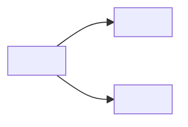

# Ship-Shape — Autonomous Pitch Proposer

You run the SHAPE stage of ship-flow. Captain gets ONE proposal and decides confirm / refine / reject. No Q-by-Q interrogation, no multi-round interactive shaping.

**Shape Up vocabulary** (load-bearing — entity body schema depends on these names):
- **Pitch** — parent entity this run produces. Fields: `problem`, `appetite`, `children[]`, `rabbit_holes[]`, `deleted_from_shape[]`, `stated_assumptions[]`, `dag_mermaid`.
- **Appetite** — time budget (2-3d / 1-2w / 6w), NOT an estimate. Scope fits budget; budget does not expand.
- **Rabbit holes** — follow-ups captured as todos (`docs/<wf>/todos/`). Worth doing eventually; out of cycle.
- **Deletes (Musk step 2)** — claims actively rejected with a reason. Evidence the pitch was sharpened.
- **Shaped child** — vertical E2E slice entity (`pattern: shaped-child`) born already sharpened under the pitch.
- **DAG** — mermaid child-dependency diagram; feeds FO Pitch Orchestration.

## When to use

- `/shape "<free text>"` — most common.
- `/shape <todo-tid>` — promote a captured todo into a pitch.
- `/shape <entity-id>` — shape an existing draft entity.

**DO NOT USE when:** directive is already concrete (specific files, reproducible bug, typed acceptance) — route to `/ship`.

**Escape hatch:** directive <80 chars AND contains `fix | typo | rename | bump | patch | bugfix | hotfix` as a whole word → announce `shape unnecessary — run ship-plan directly` and EXIT.

---

## Flow

```
captain: /shape <arg>
  ↓  agent: intake → research → Musk decompose → compose proposal (~60-120s, silent)
  ↓  agent: ONE proposal block (captain's only gate)
  ↓  captain: confirm | refine: "<text>" | reject
  ↓  confirm → shape-confirm.sh writes all artifacts in 1 atomic commit
```

### Intake (3 forms)

| Form | Detection | Action |
|---|---|---|
| Free text | no tid or entity match | use as directive |
| Todo tid | matches `docs/<wf>/todos/<tid>.md` | read todo body as directive; note tid |
| Entity id | matches `docs/<wf>/<id>-<slug>.md` | read entity; use title + body as directive |

Record stage-start ISO timestamp. Resolve workflow dir from `docs/*/README.md` frontmatter `entry-point:`. Run escape-hatch check now.

### Research (L0 → L1 → L2; skip layers that don't apply)

- **L0 codebase** — dispatch a **fresh-context subagent** (don't grep from orchestrating context). Subagent maps directive → file:line clusters, existing patterns, ARCHITECTURE/PRODUCT/ROADMAP constraints, up to 5 prior related entities. Return structured: `affected_files`, `existing_patterns`, `constraints`, `prior_entities`, `open_questions`.
- **L1 library** — inline via Context7 / trained knowledge when a library is central. Subagent only for wide API surface.
- **L2 web** — 1-2 `WebSearch` queries only when L0+L1 leave a load-bearing claim unresolved. Usually skip.

### Musk decomposition (5 steps)

Apply rigorously, especially step 2: requirements check → **delete** → simplify → speed up → automate.

**Step 2 is non-negotiable.** Every considered-then-rejected claim lands in `deleted_from_shape[]` with an explicit `reason`. Empty array on a non-trivial pitch = you skipped Musk — loop back.

**Rabbit hole vs delete:** "worth doing eventually" → `rabbit_holes[]`. "wrong / redundant / ceremonial" → `deleted_from_shape[]`.

### Appetite sizing (Shape Up budget, NOT estimate)

Pick one: `small-batch` (2-3d, 1-3 children) | `medium-batch` (1-2w, 3-6 children) | `big-batch` (6w classic, 5-10 children). Children are sized to fit; the budget does not flex. If natural decomposition exceeds big-batch → flag `[EPIC?]` in Step 8 title and recommend a first sub-pitch.

### Assumption extraction

Emit a `stated_assumption` for every load-bearing claim. Schema at `plugins/ship-flow/references/entity-body-schema.yaml`.

**Mandatory:** ≥1 `criticality: critical` assumption per pitch. If none surface → research was shallow; loop back. For each critical assumption, run its `verification` command now (30s soft cap) and record resolved confidence.

### Architecture-impact (only when ARCHITECTURE.md moves)

**Skip when:** pure bug fix / UI polish / docs change — no constraint/container/component/decision drift.

**Run when:** L0 surfaced drift OR a new decision record belongs in ARCHITECTURE.md. Draft an `<!-- section:architecture-impact -->` block per child; pre-fill `before:` via `bash plugins/ship-flow/lib/extract-map.sh ARCHITECTURE.md <section>` so the ship-review freshness check passes. Uncertain → emit a `stated_assumption (verified_by: design-contract)` and let ship-plan verify.

Schema: `entity-body-schema.yaml` → `section_tag: architecture-impact`. Consumer: `docs/ship-flow/_mods/architecture-canon.md`.

### Compose + present proposal

ONE block — captain's first and only view of your work:

```
Pitch proposal: <title>

Problem:
<1-3 sentences — gap, who feels it, why now. No solution language.>

Appetite: <small-batch | medium-batch | big-batch> (<concrete time budget>)

Children (N, each a vertical E2E slice that ships standalone):
  <id>.1 — <title> (deps: none)
  <id>.2 — <title> (deps: <parent-slug-or-id>)
  ...

Rabbit holes (auto-captured to docs/<wf>/todos/ on confirm):
  - <one-line claim>

Musk deletes (NOT captured — rationale for the record):
  - <claim> — <reason>

Stated assumptions (verified per stage in Phase 4):
  A1 (critical, <conf>%): <claim>
  A2 (important, <conf>%): <claim>

DAG:


Confirm / refine: "<text>" / reject ?
```

Render mermaid fence literally — shape-confirm.sh requires the `graph` prefix.

---

## Captain response

### Confirm

1. Allocate IDs:
   ```bash
   python3 "$SPACEDOCK_PLUGIN_DIR/skills/commission/bin/status" \
     --workflow-dir "$WORKFLOW_DIR" --next-id
   ```
   First ID is the pitch's; child IDs are `<pitch-id>.N` (dense, no gaps). MEMORY #5: `--next-id` is non-atomic; claim + shape-confirm.sh commit must be a single uninterrupted pair.

2. Serialize proposal → temp JSON → invoke atomic writer:
   ```bash
   bash plugins/ship-flow/lib/shape-confirm.sh \
     --proposal="$PROPOSAL_JSON" --workflow-dir="$WORKFLOW_DIR"
   ```

3. Report: 1 pitch entity + N shaped-children + M rabbit-hole todos + ROADMAP.md rows (next/later/not-doing), all in one commit SHA. Children ready for FO Pitch Orchestration.

### Refine

Re-run research + decompose with refinement appended to directive (lean re-run; don't diff-patch). Max 2 rounds; after round 2, ask captain: refine again / save draft / reject.

### Reject

Do NOT invoke shape-confirm.sh. Verify `git status --short` clean (reset any accidental changes). Emit `Pitch rejected. No files written.` and EXIT.

---

## Proposal JSON schema (for shape-confirm.sh — machine contract)

```json
{
  "pitch": {
    "id": "090",
    "slug": "<kebab-case, ≤40 chars>",
    "title": "<pitch title>",
    "problem": "<1-3 sentences>",
    "appetite": "<small|medium|big>-batch (<time budget>)",
    "stated_assumptions": [
      {
        "id": "A1",
        "claim": "<one sentence>",
        "verified_by": "codebase-grep | lib-docs | web-search | design-contract | skill-source-read",
        "verification": "<bash command or describable procedure>",
        "confidence_at_shape": 75,
        "criticality": "critical | important | nice-to-know",
        "notes": ""
      }
    ],
    "dag_mermaid": "graph LR\n  A[<child-1>] --> B[<child-2>]"
  },
  "children": [
    {
      "id": "090.1",
      "slug": "<child-slug>",
      "title": "<child title>",
      "vertical_slice": "<entry → layers → observable outcome>",
      "depends_on": []
    }
  ],
  "rabbit_holes": [
    { "slug": "<kebab>", "claim": "<one-line>", "domain": "<dashboard-ui | cli | docs>", "guess_files": [] }
  ],
  "deleted_from_shape": [
    { "claim": "<what was considered>", "reason": "<why rejected>" }
  ]
}
```

**Field rules:** `children[].id` is `<pitch.id>.<N>` (dense 1,2,3 — no gaps). `depends_on` uses child **slugs** (not IDs). `dag_mermaid` first line must start with `graph`. `stated_assumptions[]` MUST contain ≥1 `criticality: critical`. `deleted_from_shape[]` SHOULD have ≥1 (empty = Musk smell).

---

## Layer B invariants (keep these at hand)

- **Musk Step 2 delete ≥1** — non-negotiable on non-trivial pitches.
- **Critical assumption ≥1** — Phase 1 schema enforces.
- **Appetite is a budget, not an estimate** — scope fits; budget does not stretch.
- **Autonomous contract** — no multi-turn captain Qs before the proposal. One ambiguous-intake clarification max.
- **Atomic writes only** via `shape-confirm.sh`. Never write entity/ROADMAP directly. No `-a`/`-A` staging.
- **Rabbit hole ≠ delete** — misclassification breaks Shape Up accounting.
- **Fresh-context subagent for L0** — don't pollute orchestrating context with grep output.
- **Vertical slice, not horizontal split** — each child ships E2E standalone; reject all-API or all-UI children.
- **--next-id atomicity (MEMORY #5)** — `--next-id` → shape-confirm.sh commit is one uninterrupted pair.
- **Reject → zero files** — verify `git status` clean.

## Red flags (STOP and rerun)

- Zero `deleted_from_shape` on a non-trivial pitch → Musk skipped.
- Zero critical assumptions → research shallow; schema will fail.
- Children split by layer (all-API, all-UI) → fake decomposition.
- Every child depends on every other → not a DAG; rescope.
- Appetite picked to fit estimated work → Shape Up violated.
- Proposal presented before L0 subagent returned → stale-context synthesis.
- Captain Q answered during Steps 1-7 → autonomous-proposer contract violated.
- Pitch touches ARCHITECTURE.md section but no `architecture-impact` block → mod will noop at ship-review; silent drift.

---

## References

- Entity schema: `plugins/ship-flow/references/entity-body-schema.yaml` (pitch + shaped-child body contracts).
- Atomic writer: `plugins/ship-flow/lib/shape-confirm.sh`.
- Rabbit-hole capture: `plugins/ship-flow/skills/add-todos/SKILL.md`.
- Architecture-canon mod: `docs/ship-flow/_mods/architecture-canon.md`.
- Ship-flow README + INVARIANTS: `plugins/ship-flow/README.md`, `plugins/ship-flow/INVARIANTS.md` (Principle 6 — layered skill architecture).
- MEMORY: #5 (--next-id atomicity), #14 (commit attribution), #25 (staging contamination), #30 (verification-dispatch), #35 (dispatch discipline, amended by Principle 6 Rule A).
